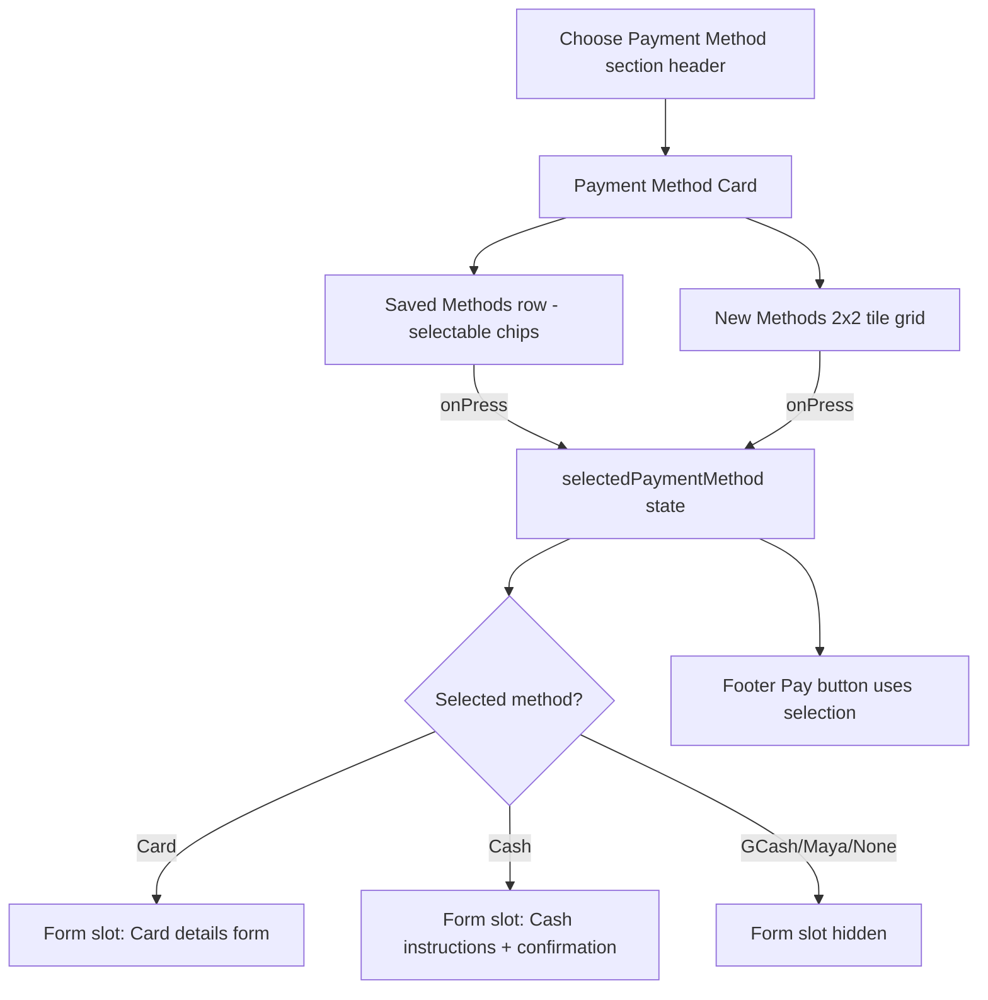

# Requirements

### Overview & Goals
Refactor the **Choose Payment Method** section of `apps/mobile/app/tenant/payment/index.tsx` to give it a clearer visual hierarchy, unify saved and new payment methods, and present the per‑method form (card / cash) in a more contained, less jarring way.

The rest of the screen (header, apartment details, payment summary, footer with Pay button) stays untouched — this plan is scoped to the payment method selection block and the conditional forms tied to it.

### Scope
**In scope**
- Layout and grouping of *Saved Payment Methods* and *Add New Payment Method*.
- Visual treatment of each method option (GCash, Maya, Debit/Credit Card, Cash).
- Presentation of the conditional Card form and Cash form.
- Empty / no‑saved‑methods state.

**Out of scope**
- Business logic (`handlePay`, Luhn check, routing).
- Payment Summary card and apartment details block.
- Backend / API wiring, new payment providers.
- Creating brand‑new shared components unless strictly necessary; prefer reusing `PaymentMethodButton`, `RadioButton`, `Card`, `Separator`, `Divider`, `TextField`, `DateTimeField`, `NumberField`, `CheckBox`.

### User Stories
- As a returning tenant, I want to pick a **previously saved** method in one tap so I can pay quickly without re‑entering details.
- As a new tenant, I want the **new payment methods** to be visually distinct and easy to scan (logo + label), not just a plain radio list.
- As a card payer, I want the **card form to feel attached to the selected card option** so it's obvious which method I'm filling in.
- As a cash payer, I want clear **instructions and a confirmation form** grouped together, separated from card fields.

### Functional Requirements
- Saved methods (when present) appear **first**, as a horizontally scrollable / wrapped row of selectable tiles; tapping a tile selects it as the active payment method.
- New methods appear as a **2×2 grid of selectable tiles** (logo + label) instead of a vertical radio list. The currently selected tile shows a clear selected state (border/background + check indicator).
- Only **one** method (saved *or* new) can be selected at a time — selecting a new tile clears any saved selection and vice versa.
- When Card is selected, the card form renders inside a **dedicated card‑style container directly under the tile grid**, visually connected to the selection (not floating below a divider).
- When Cash is selected, the cash instructions + confirmation form render in the same container slot with its own heading.
- When no method is selected, the container slot is not rendered (keeps the screen short).
- Empty saved‑methods state is handled by simply hiding the *Saved Payment Methods* block (current behavior preserved via `hasSavedPaymentMethod`).

### Non-Functional Requirements
- Must remain fully usable on small phone widths — tiles wrap, no horizontal overflow.
- Consistent with existing design tokens (`text-secondary`, `text-muted`, `border-border`, `bg-surface`, `font-inter*`).
- Touch targets ≥ 44pt.
- No regression in keyboard behavior for the card and cash forms (still inside `ScreenWrapper scrollable`).

# Technical Design

### Current Implementation
In `apps/mobile/app/tenant/payment/index.tsx`, the payment method area is a flat sequence of `View`s:

1. Section title + subtitle (`Choose Payment Method`).
2. If `hasSavedPaymentMethod`: a `flex-row flex-wrap` of `PaymentMethodButton` logos, followed by a hand‑built `or` separator.
3. `Add New Payment Method` label + 4 vertical `RadioButton`s (GCash, Maya, Debit/Credit Card, Cash).
4. Conditional Card form (`TextField`, `DateTimeField`, `TextField`, `NumberField`, `CheckBox`) after a `Divider` when `selectedPaymentMethod === 'Debit/Credit-Card'`.
5. Conditional Cash instructions + form after a `Divider` when `selectedPaymentMethod === 'Cash'`.

Pain points:
- Saved methods are visually rich (logos) while new methods are plain radios — inconsistent.
- The `PaymentMethodButton` tiles for saved methods are **not visibly selectable** (no selected state wired in).
- Card / Cash forms appear far below with only a thin `Divider`, so the link between selected option and form is weak.
- Vertical radio list wastes space and doesn't leverage brand logos users recognize.
- `or` separator is custom and slightly out of place.

### Key Decisions
- **Unified tile-based selector**: Replace the vertical `RadioButton` list with a 2×2 grid of tiles (logo + label + selected indicator). Reuse/extend `PaymentMethodButton` to accept a `selected` prop and a `label`.
- **Group into a single "Payment Method" Card**: Wrap Saved + New + conditional form in one `Card` container so the section reads as one cohesive block, mirroring the existing Payment Summary `Card` styling.
- **Form-in-slot pattern**: Reserve one area under the tile grid that swaps between: nothing / card form / cash instructions + form. This makes the connection between selection and form explicit.
- **Single source of truth for selection**: Keep `selectedPaymentMethod` but broaden its type to include saved‑method identifiers (e.g. `{ kind: 'saved', id } | { kind: 'new', method: PaymentMethod }`) so saved and new selections are mutually exclusive by construction.
- **Drop the custom `or` divider**: With a single unified container and a clear section subheading (`Saved` / `Or use a new method`), the `or` chip becomes redundant.

### Proposed Changes
New visual structure of the section, top to bottom:

1. **Section header** — `Choose Payment Method` + subtitle (unchanged copy).
2. **Payment Method Card** (`Card` from `heroui-native`, matches Payment Summary card):
   - **Saved Payment Methods** subsection (only if `hasSavedPaymentMethod`):
     - Small label `Saved` + optional `Manage` link (future).
     - Horizontal wrap of selectable `PaymentMethodButton` tiles showing logo + last‑4 (e.g. `Visa •• 4242`). Selected tile: primary border + check badge.
   - `Separator` (only if saved section present).
   - **Use a new method** subsection:
     - 2×2 grid of tiles: GCash, Maya, Debit/Credit Card, Cash. Each tile: logo (or icon for Cash) on top, label below, selected indicator in top‑right corner.
   - **Form slot** (only rendered if a *new* method that needs a form is selected):
     - Card form: heading `Card Details`, then existing inputs (`Card Number`, `Expiry Date`, `Cardholder Name`, `CVV` with helper text, `Save this card` checkbox). Rendered inside a subtle inset (e.g. `bg-surface-2` / rounded container) to visually attach it to the selected tile.
     - Cash form: heading `Cash Payment` + instructions paragraph, then `Payment Date` and `Amount Paid` fields inside the same inset container.

3. Footer (Total Rent Due + Pay button) — unchanged.

### Data Models / Contracts
Extend selection state to disambiguate saved vs new:

```ts
type NewPaymentMethod = 'GCash' | 'Maya' | 'Debit/Credit-Card' | 'Cash';

type SelectedPaymentMethod =
 { kind: 'saved'; id: string; method: NewPaymentMethod }
 { kind: 'new';   method: NewPaymentMethod }
 null;
```

`PaymentMethodButton` prop surface (proposed):

```ts
type PaymentMethodButtonProps = {
  imageSource: ImageSourcePropType;
  label?: string;         // e.g. 'GCash' or 'Visa •• 4242'
  selected?: boolean;
  onPress?: () => void;
  variant?: 'tile' | 'chip'; // tile = grid cell, chip = saved-methods row
};
```

### Components
- **`PaymentMethodButton`** (existing, extended): add `selected`, `label`, `onPress`, `variant`. Handles both saved chips and new-method tiles.
- **`RadioButton`**: no longer used in this section (kept for other screens).
- **`Card`, `Separator`, `Divider`**: reused from `heroui-native` / existing components; the outer `Divider` before conditional forms is removed in favor of the form slot inside the Card.
- **Card form inputs** (`TextField`, `DateTimeField`, `NumberField`, `CheckBox`) and **Cash form inputs** (`DateTimeField`, `NumberField`) — unchanged, just relocated into the form slot.

### File Structure
- Modified: `apps/mobile/app/tenant/payment/index.tsx` — restructure the Payment Method section and update selection state shape.
- Modified: `apps/mobile/app/tenant/payment/components/PaymentMethodButton.tsx` — add `selected` / `label` / `variant` support and selected‑state styling.
- No new files required.

### Architecture Diagram


### Risks
- **Selection state migration**: broadening `selectedPaymentMethod` shape touches `handlePay`. Mitigation: keep a small helper `getMethodKind(selected)` to preserve current branching.
- **`PaymentMethodButton` reuse elsewhere**: adding props must remain backward‑compatible; make new props optional.
- **Tile layout on very narrow screens**: 2×2 grid could squeeze labels. Mitigation: allow tiles to wrap to 1 column below a threshold, or truncate label with `numberOfLines={1}`.
- **Accessibility**: tiles must expose `accessibilityRole="radio"` and `accessibilityState={{ selected }}` since we're replacing native‑ish radios.

# UX Benefits

### Why this layout is better

**1. One coherent block instead of three loose sections**  
Today, saved methods, new methods, and the form live as three visually disconnected stripes separated by dividers and a custom `or` chip. Grouping them inside a single `Card` (matching the Payment Summary card above) creates a clear mental model: *"this card is where I choose and configure how I pay."*

**2. Consistent visual language for saved vs new methods**  
Currently saved methods are logo tiles while new methods are plain radio rows — the same concept rendered two different ways. Using **tiles for both** (with a `selected` state on saved chips and a 2×2 grid for new methods) makes the choices feel equivalent and directly comparable.

**3. Faster recognition via brand logos**  
Replacing the vertical radio list with logo tiles (GCash, Maya, Visa/Mastercard icon for Card, cash icon for Cash) leverages **brand recognition**, which is faster than reading text labels — especially valuable on mobile.

**4. Clear selected state and mutual exclusivity**  
Modeling selection as `{ kind: 'saved' | 'new', ... }` guarantees the user can never accidentally have both a saved chip and a new radio visually "on". A single, obvious selected tile removes ambiguity about what pressing **Pay** will do.

**5. Form feels attached to the choice**  
Moving the card / cash form into a **slot immediately below the tile grid, inside the same Card**, visually connects the form to the selected tile. Today the form appears far down after a thin `Divider`, which can feel like a separate section unrelated to the tile the user just tapped.

**6. Less vertical scrolling for common cases**  
A 2×2 tile grid is roughly **half the height** of four stacked radio rows. Users who pick GCash / Maya (no form needed) see the Pay button almost immediately without scrolling.

**7. Progressive disclosure**  
The form slot only appears when a method that needs input is selected. GCash and Maya show nothing extra (they redirect on Pay), Card and Cash reveal their respective forms inline. Users only see what's relevant to their choice.

**8. Better empty state**  
When `hasSavedPaymentMethod` is false, dropping the custom `or` divider and simply showing *"Use a new method"* as the sole subsection makes the screen feel intentional rather than "missing a section".

**9. Accessibility improvements**  
Tiles with explicit `accessibilityRole="radio"` and `accessibilityState={{ selected }}` communicate selection state to screen readers more reliably than a custom radio + custom logo button mix.

**10. Future‑proof**  
The tile grid + form‑slot pattern trivially scales: adding *Bank Transfer*, *Apple Pay*, or a new saved card is just another tile — no restructuring of the section.

# Delivery Steps

### ✓ Step 1: Extend PaymentMethodButton with selected state, label, and variant
`PaymentMethodButton` can render as either a saved‑method chip or a new‑method grid tile with a clear selected state.

- Add optional props: `label?: string`, `selected?: boolean`, `onPress?: () => void`, `variant?: 'tile' | 'chip'`.
- Implement selected styling: primary‑colored border, subtle background tint, and a small check badge in the top‑right corner.
- `tile` variant: square-ish, logo on top, label centered below with `numberOfLines={1}`.
- `chip` variant: horizontal, logo + label side by side (for the saved methods row).
- Add `accessibilityRole="radio"` and `accessibilityState={{ selected }}` for screen‑reader support.
- Keep all new props optional so existing usages don't break.

### ✓ Step 2: Refactor selection state and restructure the Payment Method section into a unified Card
The Choose Payment Method area lives inside a single `Card` with Saved Methods, New Methods (2×2 tile grid), and a form slot, driven by a single mutually‑exclusive selection state.

- In `apps/mobile/app/tenant/payment/index.tsx`, broaden `selectedPaymentMethod` to `{ kind: 'saved'; id; method } | { kind: 'new'; method } | null`.
- Wrap the whole Choose Payment Method block (title, subtitle, saved row, new grid, form slot) inside a `Card` styled like the existing Payment Summary card.
- Render the Saved Payment Methods row (only if `hasSavedPaymentMethod`) using `PaymentMethodButton` in `chip` variant, each with a `selected` state bound to the new selection shape.
- Replace the four vertical `RadioButton`s with a 2×2 grid of `PaymentMethodButton` tiles (GCash, Maya, Debit/Credit Card, Cash), each toggling `{ kind: 'new', method }`.
- Add a `Separator` between Saved and New subsections when Saved is present; remove the custom `or` divider block.
- Update `handlePay` to read from the new selection shape via a small helper (`getSelectedMethod(selected)`).

### ✓ Step 3: Move Card and Cash forms into an in‑Card form slot with progressive disclosure
The Card details form and Cash instructions/confirmation form render inside a dedicated slot directly under the tile grid, visually attached to the selected tile.

- Add a `formSlot` area at the bottom of the Payment Method `Card` that conditionally renders based on the current selection's `method`.
- Card branch: render inside a subtle inset container (rounded, slightly different background) with a `Card Details` heading, then the existing `Card Number`, `Expiry Date`, `Cardholder Name`, `CVV` (with helper text), and `Save this card` checkbox — reusing the current handlers and validation.
- Cash branch: render in the same inset container with a `Cash Payment` heading, the current instructions paragraph, then `Payment Date` and `Amount Paid` fields.
- Do not render the slot when the selected method is GCash, Maya, a saved method that needs no form, or `null`.
- Remove the old `Divider` elements that previously separated the forms; the slot's inset container replaces them.
- Verify keyboard/scroll behavior still works inside `ScreenWrapper scrollable` on small screen widths and that tiles wrap gracefully.