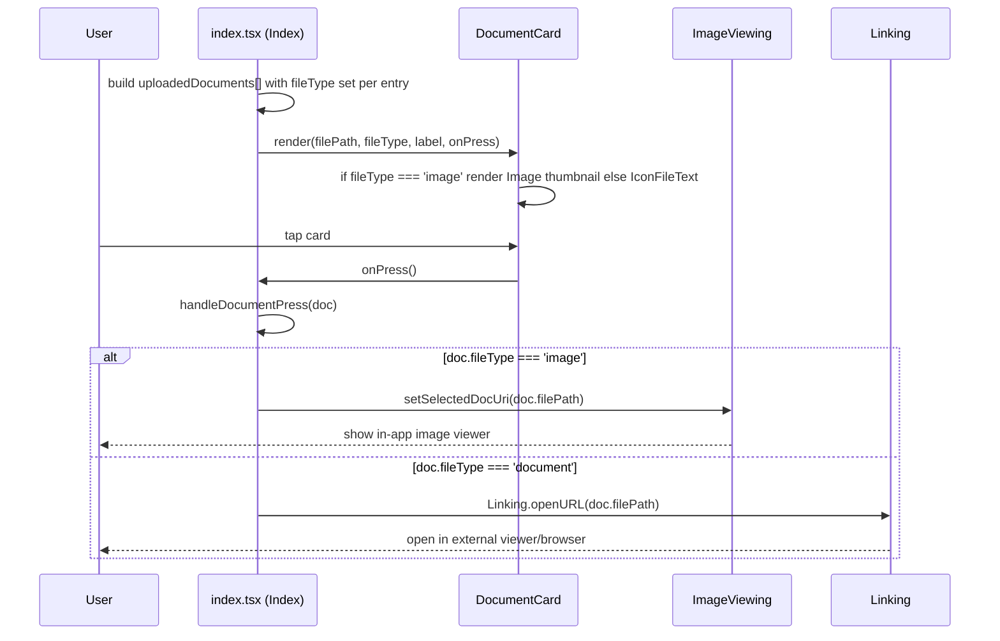

# Design Document: Document File Type Detection

## Overview

`document-id/index.tsx` decides whether tapping an uploaded document opens the in-app `ImageViewing` modal or falls back to `Linking.openURL` by sniffing the file extension out of `filePath` at render/press time. For the three bundled mock assets (Proof of Income, Proof of Residency, Birth Certificate), `RNImage.resolveAssetSource(...).uri` resolves to a Metro dev-server URL where the `.jpg` extension is not reliably present before the `?` — it can be embedded only inside a query parameter (e.g. `unstable_path=...jpg`). `getExtension()` (which splits on `?` then `.`) then returns an empty or wrong string, `IMAGE_EXTENSIONS` lookup fails, and the code wrongly calls `Linking.openURL`, kicking the user out to the browser for what is actually an image.

This fix replaces extension-sniffing with an explicit `fileType: 'image' | 'document'` field carried on each document record — a single source of truth set once at data-creation time, consumed unchanged by both the press handler and the card renderer. This does not touch `mainValidId`/`isIdVisible`, which already has no dependency on extension sniffing.

## Main Algorithm/Workflow



## Core Interfaces/Types

```typescript
// apps/mobile/app/document-id/index.tsx

type DocumentFileType = 'image' | 'document'

type UploadedDocument = {
  id: number
  type: string          // human-readable label, e.g. "Proof of Income"
  filePath: string       // local asset uri today; Supabase signed URL in the future
  fileType: DocumentFileType
}
```

```typescript
// apps/mobile/app/document-id/components/DocumentCard.tsx

interface DocumentCardProps {
  filePath: string
  fileType: DocumentFileType   // replaces internal getExtension()-derived isImage
  label: string
  onPress: () => void
}
```

Note: `DocumentFileType` is a small, file-local union used only by these two files. It is not promoted to a shared package — there is no cross-platform or multi-consumer need yet (mobile-only, two files). If a third consumer appears, revisit per AGENTS.md decision hierarchy (share only when actually shared).

## Key Functions with Formal Specifications

### Function 1: handleDocumentPress()

```typescript
function handleDocumentPress(doc: UploadedDocument): void
```

**Preconditions:**
- `doc` is a fully-formed `UploadedDocument` (non-null `filePath`, `fileType` is `'image'` or `'document'`)

**Postconditions:**
- If `doc.fileType === 'image'`: `selectedDocUri` state is set to `doc.filePath`; `Linking.openURL` is NOT called
- If `doc.fileType === 'document'`: `Linking.openURL(doc.filePath)` is called; `selectedDocUri` state is NOT modified
- No extension parsing occurs; decision depends only on `doc.fileType`

**Loop Invariants:** N/A (no loops)

### Function 2: DocumentCard render decision

```typescript
function DocumentCard(props: DocumentCardProps): JSX.Element
```

**Preconditions:**
- `props.fileType` is `'image'` or `'document'`
- `props.filePath` is a non-empty string usable as an `Image` source uri when `fileType === 'image'`

**Postconditions:**
- If `props.fileType === 'image'`: renders `<Image source={{ uri: props.filePath }} .../>` thumbnail
- If `props.fileType === 'document'`: renders `<IconFileText .../>` placeholder
- No `getExtension` call occurs; no `IMAGE_EXTENSIONS` lookup occurs

**Loop Invariants:** N/A (no loops)

## Algorithmic Pseudocode

### Document press routing

```pascal
PROCEDURE handleDocumentPress(doc)
  INPUT: doc of type UploadedDocument
  OUTPUT: none (side effect: opens viewer or external link)

  SEQUENCE
    IF doc.fileType = 'image' THEN
      setSelectedDocUri(doc.filePath)
    ELSE
      Linking.openURL(doc.filePath)
    END IF
  END SEQUENCE
END PROCEDURE
```

**Preconditions:** `doc.fileType` ∈ {'image', 'document'}
**Postconditions:** exactly one of {open in-app viewer, open external link} occurs, matching `doc.fileType`
**Loop Invariants:** N/A

## Example Usage

```typescript
// Mock data construction (index.tsx) — fileType set once, at the source
const uploadedDocuments: UploadedDocument[] = [
  {
    id: 1,
    type: 'Proof of Income',
    filePath: RNImage.resolveAssetSource(SAMPLE_IMAGES.sampleProofOfIncome).uri,
    fileType: 'image', // bundled .jpg sample asset
  },
  {
    id: 2,
    type: 'Proof of Residency',
    filePath: RNImage.resolveAssetSource(SAMPLE_IMAGES.sampleProofOfResidency).uri,
    fileType: 'image',
  },
  {
    id: 3,
    type: 'Birth Certificate',
    filePath: RNImage.resolveAssetSource(SAMPLE_IMAGES.sampleBirthCertificate).uri,
    fileType: 'image',
  },
]

// Press handling — no extension parsing
const handleDocumentPress = (doc: UploadedDocument) => {
  if (doc.fileType === 'image') {
    setSelectedDocUri(doc.filePath)
  } else {
    Linking.openURL(doc.filePath)
  }
}

// Render call site
uploadedDocuments.map(doc => (
  <DocumentCard
    key={doc.id}
    filePath={doc.filePath}
    fileType={doc.fileType}
    label={doc.type}
    onPress={() => handleDocumentPress(doc)}
  />
))
```

```typescript
// DocumentCard.tsx — render decision, no getExtension()
{fileType === 'image' ? (
  <Image source={{ uri: filePath }} style={{ width: '100%', height: '100%' }} contentFit='cover' cachePolicy='disk' transition={150} />
) : (
  <IconFileText size={40} color={colors.gray400} />
)}
```

## Correctness Properties

*A property is a characteristic or behavior that should hold true across all valid executions of a system-essentially, a formal statement about what the system should do. Properties serve as the bridge between human-readable specifications and machine-verifiable correctness guarantees.*

### Property 1: fileType alone determines press routing

For any `UploadedDocument`-shaped input with `fileType: 'image'`, calling `handleDocumentPress` results in `setSelectedDocUri` being invoked with that document's `filePath`, and `Linking.openURL` is never invoked — regardless of what `filePath` string is supplied (including strings with no extension, a query string, or a misleading extension).

### Property 2: fileType alone determines fallback routing

For any `UploadedDocument`-shaped input with `fileType: 'document'`, calling `handleDocumentPress` results in `Linking.openURL` being invoked with that document's `filePath`, and `setSelectedDocUri` is never invoked — regardless of what `filePath` string is supplied.

### Property 3: DocumentCard rendering is determined solely by the fileType prop

For any `filePath` string and `fileType` value passed to `DocumentCard`, the component renders the `Image` thumbnail if and only if `fileType === 'image'`, and renders `IconFileText` if and only if `fileType === 'document'` — independent of the content or shape of `filePath`.

## Error Handling

### Error Scenario 1: `Linking.openURL` rejects (unopenable URL/no handler)

**Condition:** `doc.fileType === 'document'` and the resolved `filePath` cannot be opened (e.g. no app registered, invalid URL) — this is pre-existing behavior, not introduced by this change.
**Response:** Out of scope for this fix; existing behavior is unchanged (the promise rejection is currently unhandled in `index.tsx`). No new error handling is being added here since it isn't part of the reported bug.
**Recovery:** N/A — unchanged from current behavior.

### Error Scenario 2: Missing `fileType` on a future data source (e.g. malformed record)

**Condition:** A future real (non-mock) `UploadedDocument` is constructed without a `fileType`.
**Response:** TypeScript's `strict: true` makes `fileType` a required field on the `UploadedDocument` type, so this is a compile-time error, not a runtime one — no defensive runtime fallback is introduced.
**Recovery:** N/A (caught at compile time).

## Testing Strategy

### Unit Testing Approach

- Unit test `handleDocumentPress`-equivalent logic (extracted as a small pure function or tested via component interaction) for the two concrete mock cases: an `'image'` doc opens the viewer, a `'document'` doc calls `Linking.openURL`.
- Unit test `DocumentCard` rendering for `fileType='image'` (renders `Image`) and `fileType='document'` (renders `IconFileText`), using representative `filePath` values including one with no extension and one with a query string, to demonstrate the fix no longer depends on `filePath` shape.
- No test framework currently exists in the repo (per AGENTS.md); if introduced for this fix, it should be the ecosystem-standard choice for Expo/React Native (e.g. Jest + React Native Testing Library) and scoped minimally — see tasks.md for setup task.

### Property-Based Testing Approach

- Properties 1–3 above are suitable for property-based testing: generate arbitrary `filePath` strings (including edge cases: empty, no extension, extension only in query string, misleading extension) crossed with both `fileType` values, and assert the routing/rendering decision depends only on `fileType`.
- **Property Test Library**: `fast-check` (pairs with Jest; no existing PBT library in the repo, so this is a new minimal dependency scoped to test files only).

### Integration Testing Approach

- Not applicable — this fix has no external service or infrastructure dependency (no Supabase calls involved in either code path).

## Performance Considerations

None — this is a routing/branching logic change with no additional computation, network calls, or re-renders introduced. Removing `getExtension()` calls is a marginal simplification, not a performance-motivated change.

## Security Considerations

None new. `Linking.openURL(doc.filePath)` behavior for `'document'`-typed entries is unchanged from today. No new user input or external data is introduced by this fix.

## Forward-Compatibility Notes (non-binding, for future work)

- `documents` table/migration does not exist yet in Supabase; persistence remains a TODO in `upload.tsx`'s `handleAddDocument`.
- When real persistence is wired up, `fileType` should be derived **once**, at upload time, from `DocumentPickerAsset.mimeType` in `upload.tsx`'s `handleAddDocument` (`mimeType.startsWith('image/')` → `'image'`, else `'document'`), and persisted in the database alongside the storage path — not re-derived from the signed URL at render time. This preserves the "single source of truth set at creation, not re-derived at render" pattern established by this fix.
- This future work is explicitly out of scope for this spec; no schema or migration changes are made here.

## Dependencies

- No new production dependencies.
- Optional new dev-only dependency if property-based tests are implemented: `fast-check` (test-only, not shipped in the app bundle).
- No changes to `mainValidId` / `isIdVisible` flow, `SAMPLE_IMAGES`, `ImageViewing` usage, or any Supabase-related code.
