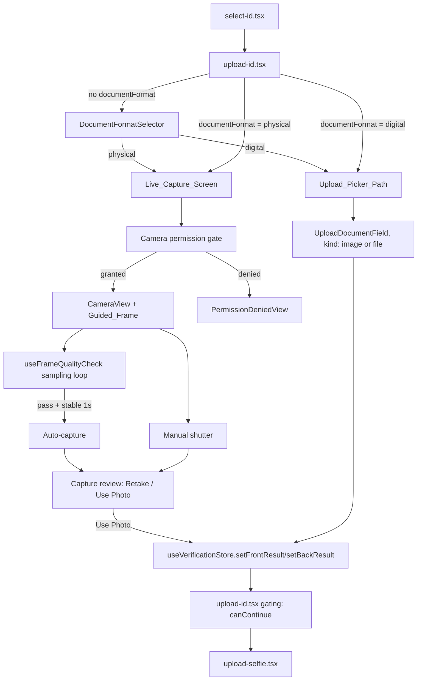
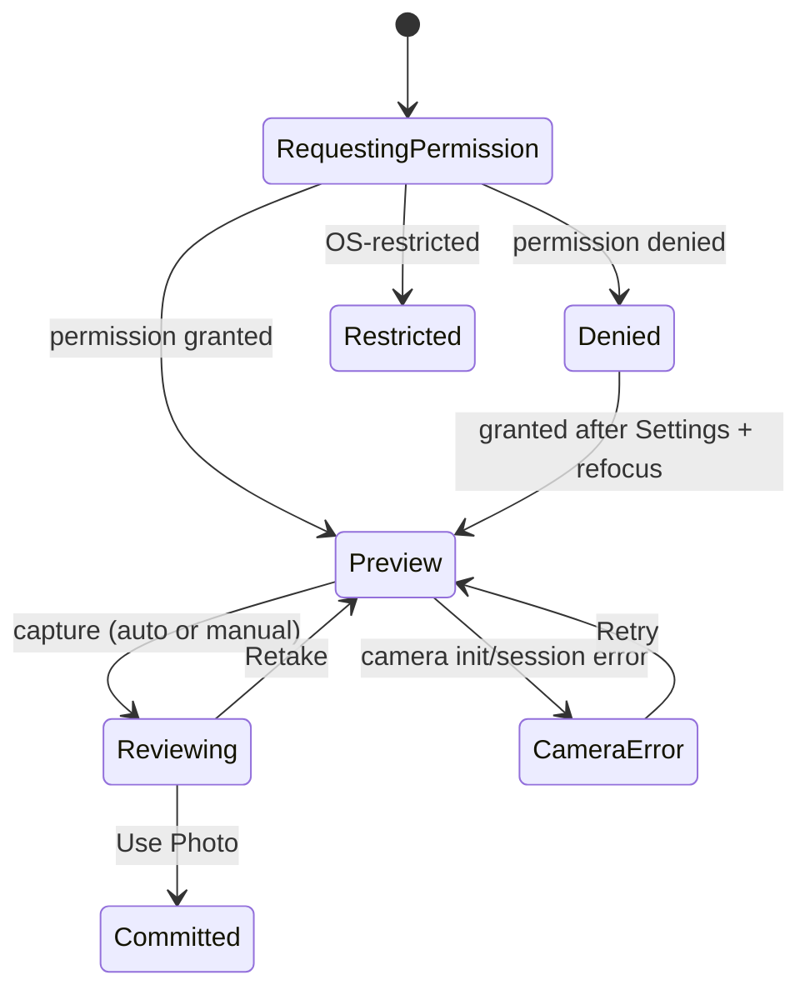

# Design Document: ID Verification Capture

## Overview

This feature branches step 2 of the mobile verification flow (`apps/mobile/app/(auth)/verify-account/upload-id.tsx`) into two capture paths based on a tenant-declared document format:

- **Physical ID** → a new in-app camera capture experience (`Live_Capture_Screen`) built on `expo-camera`, with a guided ID-card overlay, lightweight real-time quality feedback, auto-capture, a manual shutter, and a retake/confirm review step.
- **Digital Document** → the existing picker-based upload path, consolidated onto `UploadDocumentField`'s `{ kind, asset }` union (extended with a `'camera'` kind) so both paths write the same shape into `useVerificationStore`.

The document format choice is made once per verification session via a new `Document_Format_Selector`, persisted in `useVerificationStore`, and gates which entry point step 2 renders for the front/back ID fields.

This is the first camera-permission UI and the first quality-heuristic UI in `apps/mobile` — both are new patterns, not reuses of existing code, and are called out as such below (see Open Questions items 1–2 in requirements.md).

### Feasibility constraint: `expo-camera` has no live frame-pixel API

`expo-camera`'s `CameraView` JS API (`onCameraReady`, `takePictureAsync`, `recordAsync`) does **not** expose a frame processor or raw pixel buffer stream to JS — that capability belongs to `react-native-vision-camera` (frame processors + worklets), which is a different, heavier native module and out of scope for this feature (adding it is a much larger dependency/architecture change than what these requirements ask for).

Consequently, "continuously evaluate the Frame_Quality_Check against the current preview frame" (Requirement 2.4) **cannot be implemented as true per-frame pixel analysis** without a native module. The design below implements it as **periodic still-capture sampling**: `takePictureAsync` is called on an interval against a low-resolution, no-shutter-effect capture, and the blur/glare/fill-ratio heuristics run against that still frame instead of a live pixel stream. This is visually indistinguishable to the tenant from true live analysis (sub-second interval, no visible shutter), but it is important to document plainly:

- It is **not** reading the actual camera preview pixels — it is taking cheap, throwaway stills at an interval and discarding them after scoring.
- It has higher latency than a true frame processor (bounded by capture round-trip time, typically 150–400ms on modern devices), which is why Requirement 2.5's "stable for 1 second" is implemented as "N consecutive passing samples across ~1 second of sampling," not a continuous 60fps signal.
- If a future requirement needs true real-time (30fps+) frame analysis (e.g. live face-tracking), that will require migrating to `react-native-vision-camera` — this design does not attempt that migration.

This tradeoff is called out again in Components and Interfaces and Testing Strategy.

## Architecture



### Screen/route structure

- `apps/mobile/app/(auth)/verify-account/upload-id.tsx` — modified. Renders `DocumentFormatSelector` when no format is stored, then renders either the `Live_Capture_Screen` entry points (two tappable capture cards) or the existing `UploadDocumentField`-based picker entry points, depending on `documentFormat`.
- `apps/mobile/app/(auth)/verify-account/live-capture.tsx` — **new** route. The `Live_Capture_Screen`. Takes a `field` param (`front` | `back`) via `useLocalSearchParams`, matching the existing `document-id/upload.tsx` `useLocalSearchParams` pattern. Navigated to via `router.push` from `upload-id.tsx`; returns via `router.back()` after "Use Photo" commits the result to the store.

Using a dedicated route (rather than a modal-in-place component) matches how `select-id.tsx` → `upload-id.tsx` → `upload-selfie.tsx` are already separate routed steps, and gives the camera screen a full-screen dedicated lifecycle (mount camera on focus, unmount on blur) via `expo-router`'s focus events — simpler than managing camera mount/unmount inside a `BottomSheet` or modal on top of `upload-id.tsx`.

### Why `UploadDocumentField`'s union over separate `UploadImageField` + `UploadFileField`

Decision: **extend `UploadDocumentField`'s `{ kind, asset }` union pattern** (option b in Open Questions item 5), not the two-separate-fields pattern (option a).

Justification against Requirement 4/5 (`ID_Capture_Result` as one discriminated-union value per field):

- Requirement 5.1 requires the Live_Capture_Screen's result and the Upload_Picker_Path's result to be "equivalent for the purpose of gating." A single `ID_Capture_Result | null` per field (front/back) makes that gating a one-line null check (`!!front && !!back`). Two separate fields (image slot + file slot) would require checking "is the image slot filled OR the file slot filled" per side — an extra OR-condition duplicated at every consumption site, and it re-introduces exactly the two-state-slots-per-field problem the Introduction explicitly says to avoid.
- Requirement 5.4 requires clearing "any existing `ID_Capture_Result` whose `kind` does not match the newly selected document format" when the format is switched. With one union value per field, this is `if (result && result.kind === 'camera') clear()` — one field, one check. With two slots, switching formats would need to independently clear both the image slot and the file slot, and the "does this side have a result" check used elsewhere would need to keep re-deriving from two slots.
- `UploadDocumentField` already has `maxFileSizeMB` validation built in (Open Questions item 6 flags that `UploadFileField` has none) — reusing it satisfies Requirement 4.3 (5MB limit) without new validation code. `UploadFileField` would need size validation added from scratch.
- `UploadDocumentField` is already used in production at `document-id/upload.tsx`, so extending it (rather than retrofitting `UploadFileField`) is the smaller, lower-risk change per the Decision Hierarchy (extend before creating).

The one adaptation needed: `UploadDocumentField`'s internal `ACCEPTED_FILE_TYPES` currently includes Word doc mime types alongside PDF. Per Requirement 4.1 (JPG/PNG/PDF only), the component gains an optional `acceptedFileMimeTypes` prop (defaulting to the current Word+PDF list, so existing callers in `document-id/upload.tsx` are unaffected) and `upload-id.tsx` passes `acceptedFileMimeTypes={['application/pdf']}`. This prop affects only `pickFile()`'s `DocumentPicker.getDocumentAsync` call and the post-pick mime-type validation inside that function — `UploadDocumentField`'s separate `pickImage()` path (`ImagePicker.launchImageLibraryAsync`, JPG/PNG only) has no accepted-types list today and is not given one; it is unaffected by this prop by construction, since JPG/PNG are already the only formats `pickImage()` can produce.

## Components and Interfaces

### `useVerificationStore.ts` (breaking shape change)

```typescript
import * as ImagePicker from 'expo-image-picker';
import * as DocumentPicker from 'expo-document-picker';

export type DocumentFormat = 'physical' | 'digital';

export type IdCaptureResult =
  | { kind: 'camera'; asset: { uri: string; width: number; height: number } }
  | { kind: 'image'; asset: ImagePicker.ImagePickerAsset }
  | { kind: 'file'; asset: DocumentPicker.DocumentPickerAsset };

export type VerificationData = {
  selectedId: string | null;
  documentFormat: DocumentFormat | null;
  frontResult: IdCaptureResult | null;
  backResult: IdCaptureResult | null;
};

export type VerificationStore = VerificationData & {
  setSelectedId: (id: string | null) => void;
  setDocumentFormat: (format: DocumentFormat) => void;
  setFrontResult: (result: IdCaptureResult | null) => void;
  setBackResult: (result: IdCaptureResult | null) => void;
  reset: () => void;
};
```

- `frontImages: ImagePicker.ImagePickerAsset[]` / `backImages: ImagePicker.ImagePickerAsset[]` are **removed**, replaced by `frontResult: IdCaptureResult | null` / `backResult: IdCaptureResult | null`. This is the breaking change flagged in Open Questions item 3 — confirmed acceptable since `upload-id.tsx` is the only consumer of `frontImages`/`backImages` (no other screen reads these fields — `upload-selfie.tsx` and `success.tsx` don't reference the store's image fields at all).
- `setDocumentFormat` implements Requirement 1.7 (overwrite) by simply doing `set({ documentFormat: format })` — Zustand's `set` always overwrites, so no special-case code is needed for "already persisted" vs "first time."
- Requirement 5.4 (clear mismatched-kind results on format switch) is implemented in the `Document_Format_Selector`'s `onSelect` handler (see below), not inside the store's `setDocumentFormat`, to keep the store a plain state container and keep the "which kinds are valid for which format" business rule in the UI layer that already knows about both formats.
- The `'camera'` kind's `asset` shape is intentionally narrower than `ImagePicker.ImagePickerAsset` (just `uri`/`width`/`height`) since `expo-camera`'s `takePictureAsync` returns a plain `{ uri, width, height, exif? }` object, not an `ImagePickerAsset`. Consumers that need dimensions (e.g. a future upload step choosing compression parameters) can read `asset.width`/`asset.height` on any of the three kinds without a kind-specific branch for that field.

### `DocumentFormatSelector` (new component)

`apps/mobile/app/(auth)/verify-account/components/DocumentFormatSelector.tsx` — route-scoped (per AGENTS.md "Is it reusable, or should it stay route-scoped?" — this selector is specific to the verification flow's vocabulary of "Physical ID" vs "Digital Document" and has no other caller), following the existing convention of route-local `components/` subfolders used elsewhere in `apps/mobile` (e.g. `app/landlord/tenant-applications/components/`).

Rendered at the top of `upload-id.tsx` (Open Questions item 4 — decision: **top of step 2**, not step 1). Rationale: step 1 (`select-id.tsx`) is purely a list of ID type names with no format concept; introducing format selection there would require a second navigation/state round-trip before the tenant even sees step 2. Placing it inline at the top of `upload-id.tsx` keeps the format choice adjacent to the fields it controls, and satisfies Requirement 1.1 ("present the Document_Format_Selector before rendering the Live_Capture_Screen or Upload_Picker_Path entry points") without adding a step to `StepProgress`'s step count.

```typescript
interface DocumentFormatSelectorProps {
  value: DocumentFormat | null;
  onSelect: (format: DocumentFormat) => void;
}
```

Two `Card`/`ControlField`-style selectable options ("Physical ID" / "Digital Document") using HeroUI Native primitives, each with a short one-line description (mirrors the existing `ListGroup.Item` visual weight used in `select-id.tsx`). Once `value` is non-null, `upload-id.tsx` renders the corresponding entry points below the selector rather than replacing the selector outright — the selector stays visible and re-selectable, so Requirement 1.7 (change format after already choosing) doesn't require a "change format" secondary control; tapping the other option is the same action.

`upload-id.tsx`'s `onSelect` handler implements Requirement 5.4:

```typescript
const isCameraKind = (result: IdCaptureResult | null) => result?.kind === 'camera';
const isPickerKind = (result: IdCaptureResult | null) =>
  result?.kind === 'image' || result?.kind === 'file';

const handleFormatSelect = (format: DocumentFormat) => {
  setDocumentFormat(format);

  if (format === 'digital' && isCameraKind(frontResult)) setFrontResult(null);
  if (format === 'digital' && isCameraKind(backResult)) setBackResult(null);
  if (format === 'physical' && isPickerKind(frontResult)) setFrontResult(null);
  if (format === 'physical' && isPickerKind(backResult)) setBackResult(null);
};
```

### `Live_Capture_Screen` (`app/(auth)/verify-account/live-capture.tsx`)

```typescript
interface LiveCaptureParams {
  field: 'front' | 'back';
}
```

Composition:

- `ScreenWrapper` (no `scrollable`, since this is a full-bleed camera view) wrapping a `CameraPreview` component that owns the `expo-camera` `CameraView` ref and permission state.
- `GuidedFrameOverlay` — new presentational component (`components/display/GuidedFrameOverlay.tsx`, since it's a generic corner-bracket overlay shape with no verification-specific logic, making it plausible to reuse for any future card-shaped capture) rendering an absolutely-positioned SVG/View overlay sized to the CR80 aspect ratio (3.375:2.125), centered over the preview, with corner brackets drawn via `react-native-svg` (already a dependency) and a dimmed mask outside the frame area using semi-transparent `View`s (four rectangles) rather than introducing a new masking dependency.
- `useFrameQualityCheck` hook (new — see below) — owns the periodic-sampling loop and exposes `{ status: 'evaluating' | 'pass' | 'fail', reasons: string[] }`.
- A quality indicator strip below the guided frame (text + colored dot, HeroUI Native styling) reflecting `status`/`reasons` (Requirement 2.4 — "visibly indicate…whether the check is currently passing or failing").
- Manual shutter button (always enabled — Requirement 2.6) and, on auto-capture trigger, the same capture path is invoked programmatically.
- Capture review sub-state (`'preview' | 'reviewing'`) rendered as a full-screen `Image` (captured URI) with `Retake` / `Use Photo` buttons (Requirement 2.7–2.9) — implemented as internal screen state, not a second route, since it's a transient two-button decision over the just-captured image and doesn't need its own back-stack entry.

State machine for the screen (internal `useState`/`useReducer`, not a store — this is screen-local UI state per "keep state as local as possible"):



### `useCameraPermission` hook (new — `hooks/verification/useCameraPermission.ts`)

Thin wrapper around `expo-camera`'s `useCameraPermissions()` hook that normalizes the states the requirements care about (`granted` / `denied` / `undetermined`, plus `restricted` — `expo-camera`'s permission response maps device-policy-blocked states to `denied` with `canAskAgain: false`, which this hook translates to a `restricted` case per Requirement 3.6):

```typescript
type CameraPermissionState = 'granted' | 'denied' | 'restricted' | 'undetermined';

function useCameraPermission(): {
  state: CameraPermissionState;
  requestPermission: () => Promise<void>;
  openSettings: () => void;
};
```

- `restricted` is derived as: `status === 'denied' && !canAskAgain` (device policy / parental controls block re-prompting — `expo-camera` surfaces this via `canAskAgain: false` on the `PermissionResponse`, consistent with the standard Expo permissions pattern also used by `expo-location` etc.). There's no existing in-repo precedent for this normalization (Open Questions item 2 — confirmed no location/notification permission UI exists to copy), so this mapping is new and specific to this feature; it is intentionally generic enough (no camera-specific logic beyond calling `expo-camera`'s hook) that a future permission screen (e.g. location) could copy the pattern.
- `openSettings` calls `Linking.openSettings()` (Requirement 3.2).
- The screen re-checks permission state on focus (via `expo-router`'s `useFocusEffect`) so that returning from the OS Settings app re-evaluates `Camera_Permission_State` without an app restart (Requirement 3.3 — 2-second budget is satisfied by `useFocusEffect` firing synchronously on focus, well under 2s).

### `useFrameQualityCheck` hook (new — `hooks/verification/useFrameQualityCheck.ts`)

```typescript
interface FrameQualityResult {
  status: 'evaluating' | 'pass' | 'fail';
  reasons: Array<'blur' | 'glare' | 'fill'>;
  isStable: boolean; // true once `pass` has held for the stability window
}

function useFrameQualityCheck(
  cameraRef: RefObject<CameraView>,
  options: { enabled: boolean; sampleIntervalMs?: number; stableDurationMs?: number },
): FrameQualityResult;
```

Implementation approach (per the feasibility constraint above):

1. On an interval (`sampleIntervalMs`, default 400ms), call `cameraRef.current.takePictureAsync({ quality: 0.1, skipProcessing: true, shutterSound: false })` to get a cheap still (low quality/resolution keeps the round-trip fast — this is a throwaway sample, never shown to the user or stored).
2. Downscale the sample via `expo-image-manipulator` (already a dependency, used by `compressImage.ts`) to a small fixed size (e.g. 200×126, matching the CR80 ratio) to bound heuristic computation cost.
3. Run three heuristics against the downscaled sample:
   - **Blur**: true Laplacian-variance blur detection requires per-pixel access that neither `expo-camera` nor `expo-image-manipulator` expose to JS. **This is not feasible as specified without a native module.** The fallback implemented here is a coarser proxy: reject captures where `takePictureAsync`'s `exif.ExposureTime` is above a threshold (long exposure correlates with motion-blur risk, especially in low light). This is documented in code as a best-effort heuristic, not a real Laplacian-variance blur detector.
   - **Glare**: true per-pixel brightness-variance also requires pixel access that isn't exposed in JS — the same feasibility gap as blur. The fallback: read `exif.BrightnessValue` from `takePictureAsync`'s EXIF output (when available on-device) and flag samples whose brightness sits outside an expected mid-range band as a **coarse** glare/exposure proxy, not true variance-based glare detection.
   - **Fill ratio**: this one **is** implementable exactly as specified, since it only needs the Guided_Frame's on-screen bounding box relative to the camera preview viewport — both known layout values, not pixel data. Fill ratio is a pure geometric comparison (guided frame area ÷ preview viewport area), not a content-detection heuristic, so no frame analysis is required at all.
4. `status` is `'pass'` only when all three checks pass on the latest sample; `isStable` becomes true once `status === 'pass'` for `stableDurationMs` (default 1000ms) of consecutive passing samples, satisfying Requirement 2.5 in "N consecutive passing samples" terms rather than continuous-frame terms.

**This is flagged prominently as a design decision requiring confirmation**: blur and glare cannot be implemented as genuine pixel-level heuristics on top of `expo-camera`'s JS API. Fill ratio can be implemented exactly as specified. If true blur/glare detection is a hard requirement (not a "best effort" one), the only feasible path is adding `react-native-vision-camera` (or a native module) for frame-processor pixel access — a materially larger change than this design assumes, and one this design does not adopt without explicit confirmation, since it changes the camera stack, not just this feature's UI.

### `upload-id.tsx` modifications

- Reads `documentFormat`, `frontResult`, `backResult` from the store.
- `canContinue = !!frontResult && !!backResult && isConfirmed` (Requirement 5.2/5.3) — replaces the current `frontImages.length > 0 && backImages.length > 0`.
- Renders `DocumentFormatSelector` always at the top; below it, conditionally renders:
  - `documentFormat === 'physical'`: two capture entry cards ("Front of ID" / "Back of ID") that show a thumbnail once `frontResult`/`backResult`.`kind === 'camera'` is set, and navigate to `live-capture.tsx?field=front|back` on tap. No gallery/file picker affordance is rendered in this branch (Requirement 2.1).
  - `documentFormat === 'digital'`: two `UploadDocumentField`s (front/back), each bound to `frontResult`/`backResult` directly (its `value`/`onChange` already matches `IdCaptureResult | null` once the store's `'camera'` kind is added to the union — `UploadDocumentField`'s own `onChange` never produces a `'camera'`-kind value, so no extra mapping is needed).
  - `documentFormat === null`: neither entry point renders (Requirement 1.1).

### app.json changes (native config)

`app.json` currently has no camera or photo-library permission strings and no `expo-camera` plugin entry (confirmed — Open Questions item 1). Required additions:

```json
{
  "expo": {
    "ios": {
      "infoPlist": {
        "ITSAppUsesNonExemptEncryption": false,
        "NSCameraUsageDescription": "APT uses your camera to capture a clear photo of your ID for identity verification.",
        "NSPhotoLibraryUsageDescription": "APT accesses your photo library so you can upload a digital copy of your ID."
      }
    },
    "android": {
      "permissions": ["android.permission.CAMERA"]
    },
    "plugins": [
      "expo-router",
      "expo-splash-screen",
      "expo-font",
      "@maplibre/maplibre-react-native",
      "@react-native-community/datetimepicker",
      "expo-web-browser",
      "expo-video",
      [
        "expo-camera",
        {
          "cameraPermission": "APT uses your camera to capture a clear photo of your ID for identity verification."
        }
      ]
    ]
  }
}
```

Notes:
- `NSPhotoLibraryUsageDescription` is needed because `Digital_Document`'s image path still calls `ImagePicker.launchImageLibraryAsync` (unchanged) — this string does not exist today even though that picker path already ships, which is a pre-existing gap this feature closes incidentally.
- The native `ios/APT/Info.plist` already contains a generic `NSCameraUsageDescription` string (`"Allow $(PRODUCT_NAME) to access your camera"`) — this is a leftover/stale native project file. Since this app uses `app.json`/Expo config as the source of truth for prebuild, `app.json`'s `infoPlist.NSCameraUsageDescription` will take precedence on the next `expo prebuild`; the design supplies a more specific, user-facing string there rather than relying on the generic native one.
- Android's `AndroidManifest.xml` has no `CAMERA` permission today (confirmed) — the `android.permission.CAMERA` array entry in `app.json` is required for `expo-camera` to function on Android at all, independent of this feature's specific permission-explanation UI.
- Adding the `expo-camera` config plugin requires a native rebuild (`expo prebuild` / new dev client build) — this cannot be picked up by a JS-only OTA update, which is a deployment-sequencing note for whoever ships this (mentioned in Testing Strategy notes, not a blocking design concern).

## Data Models

### `IdCaptureResult` (see store section above for full type)

Discriminated union keyed on `kind`:
- `{ kind: 'camera', asset: { uri, width, height } }` — produced by `Live_Capture_Screen`.
- `{ kind: 'image', asset: ImagePicker.ImagePickerAsset }` — produced by `UploadDocumentField`'s image path.
- `{ kind: 'file', asset: DocumentPicker.DocumentPickerAsset }` — produced by `UploadDocumentField`'s file path.

### `DocumentFormat`

`'physical' | 'digital'` — stored as `documentFormat: DocumentFormat | null` in `useVerificationStore`, `null` meaning "not yet chosen this session" (Requirement 1.1's trigger condition).

### Storage/upload data shape (out of scope for implementation, noted for forward-compatibility)

Per Open Questions item 7, actually persisting `IdCaptureResult` to Supabase Storage is out of scope for this feature. The design still ensures `IdCaptureResult`'s shape is upload-ready by construction: every `kind` carries a `uri` (via `asset.uri`, present on all three variants — `ImagePickerAsset`, `DocumentPickerAsset`, and the camera result all expose `uri`) and enough of a content-type hint (`asset.mimeType` on `image`/`file` kinds; `image/jpeg` implied for `camera` kind since `expo-camera` always produces JPEG stills) for a future upload step to follow the existing private-bucket + signed-URL convention (`chatService.ts`'s `CHAT_IMAGES_BUCKET` pattern: `supabase.storage.from(bucket).upload(path, bytes, { contentType })`, storing the path, never a public URL) without needing to branch on `kind` beyond reading `uri`/`mimeType`.

## Correctness Properties Assessment

Most of this feature is UI composition (screen rendering, navigation, permission-gated conditional rendering) or thin store mutations. Three areas involve pure-function logic with genuine input variation worth property-testing:

- The Requirement 5.2/5.3 continue-gating rule (`(frontResult, backResult, isConfirmed) → canContinue: boolean`).
- The Requirement 5.4 format-switch clearing rule (`(currentResult, newFormat) → clearedResult`).
- The fill-ratio heuristic (`(guidedFrameRect, previewViewportRect) → ratio`) — a pure geometric calculation with meaningful input variation across device viewport sizes.

The camera capture flow itself (permission requests, `takePictureAsync`, navigation, timing/debounce behavior) is I/O-driven, stateful, or UI-rendering-heavy — not suitable for PBT; it's covered by unit/integration tests below. The blur/glare heuristics, given the feasibility findings above, resolve to EXIF-threshold comparisons — simple enough to cover with example-based unit tests rather than property tests.

PBT is applicable to this narrow slice of the feature, so the Correctness Properties section below is included, scoped to those three pure functions.

### Acceptance Criteria Testing Prework

1.7 WHEN the tenant selects a document format after one was already persisted, THE Verification_Store SHALL overwrite the previous value
  Thoughts: Trivial Zustand `set` overwrite — no meaningful input variation; a property would just restate assignment semantics.
  Classification: EXAMPLE

5.1/5.2/5.3 Continue-gating is kind-agnostic and presence-driven
  Thoughts: Pure function over front/back presence + checkbox state that must not depend on which `kind` was used — a genuine universal property over a large-enough combinatorial space (3 kinds × null, per field) to be worth generating rather than enumerating.
  Classification: PROPERTY

5.4 Format-switch clears mismatched-kind results
  Thoughts: Pure function `(result, newFormat) → result'` with an invariant (`result'`'s kind, if any, is always consistent with `newFormat`) — a genuine metamorphic/invariant property.
  Classification: PROPERTY

2.3 Guided_Frame CR80 aspect ratio / fill ratio
  Thoughts: Pure geometric function over arbitrary (continuous, large-input-space) viewport dimensions — ratio and bounds invariants hold for all valid rectangles.
  Classification: PROPERTY

2.5 Auto-capture triggers after 1s of stable passing samples
  Thoughts: Stateful timing/debounce behavior over sample sequences — valuable bugs are timing/sequencing edge cases better enumerated as specific fake-timer scenarios than generated randomly.
  Classification: EXAMPLE

2.10 Camera init/session error handling
  Thoughts: UI error-state rendering triggered by an external mocked event — a rendering concern, not a universal property.
  Classification: EXAMPLE

3.1–3.6 Camera permission state handling
  Thoughts: Finite state machine over 4 enumerated permission states driven by mocked OS/permission-API responses — enumerable, not usefully randomizable.
  Classification: EXAMPLE

4.1–4.3 Upload_Picker_Path file type/size validation
  Thoughts: Boundary-value validation logic (exact-5MB, 5MB+1, each accepted/rejected mime type) already largely covered by `UploadDocumentField`'s existing `maxFileSizeMB` check; the new `acceptedFileMimeTypes` filter is a straightforward membership test scoped to the `pickFile()` path only.
  Classification: EDGE_CASE

**Property Reflection**: Properties 1 (gating), 2 (format-switch clearing), and 3 (fill-ratio geometry) test three independent pure functions with no overlap — none subsume or are subsumed by another. No consolidation needed.

## Correctness Properties

*A property is a characteristic or behavior that should hold true across all valid executions of a system-essentially, a formal statement about what the system should do. Properties serve as the bridge between human-readable specifications and machine-verifiable correctness guarantees.*

### Property 1: Continue-gating is kind-agnostic and presence-driven

For any `frontResult: IdCaptureResult | null` and `backResult: IdCaptureResult | null` (each independently `null` or any of the three `kind` variants) and any boolean `isConfirmed`, the computed `canContinue` value SHALL equal `frontResult !== null && backResult !== null && isConfirmed === true`, regardless of which `kind` each non-null result has.

**Validates: Requirements 5.1, 5.2, 5.3**

### Property 2: Format-switch clearing preserves kind/format consistency

For any `IdCaptureResult | null` value and any target `DocumentFormat`, applying the format-switch clearing rule SHALL produce a result that is either `null`, or a value whose `kind` is `'camera'` if the target format is `physical`, or whose `kind` is `'image'` or `'file'` if the target format is `digital` — the rule SHALL never leave a result whose `kind` is inconsistent with the target format.

**Validates: Requirements 5.4**

### Property 3: Guided frame preserves CR80 aspect ratio across all viewport sizes

For any positive camera preview viewport width and height, the computed Guided_Frame rectangle SHALL have a width-to-height ratio equal to 3.375:2.125 (within floating-point tolerance), and the resulting fill ratio (guided frame area ÷ preview viewport area) SHALL always be greater than 0 and less than or equal to 1.

**Validates: Requirements 2.3**

## Error Handling

- **Camera permission denied**: `PermissionDeniedView` (Requirement 3.1) renders an explanation + `openSettings()` control; re-checked via `useFocusEffect` on screen refocus (Requirement 3.3).
- **Camera permission restricted** (OS policy): a distinct `PermissionRestrictedView` renders an explanation with no settings-link control (Requirement 3.6), since `Linking.openSettings()` cannot remedy a device-policy restriction.
- **Camera init/session error**: `CameraView`'s `onMountError` (expo-camera's error callback) sets local `cameraError` state; the screen renders an error message + "Retry" button that remounts the `CameraView` (Requirement 2.10).
- **Upload picker file type rejected**: `UploadDocumentField`'s existing inline error text pattern (`displayError`) is reused, extended to check `acceptedFileMimeTypes` membership before accepting a `DocumentPicker` result and setting an "Unsupported file type" message without calling `onChange` (Requirement 4.2) — mirrors the existing `sizeError` handling already in the component. This check applies only within `pickFile()`; `pickImage()` is untouched.
- **Upload picker file too large**: already handled by `UploadDocumentField`'s existing `maxFileSizeMB` check (Requirement 4.3) — no new code needed beyond the `acceptedFileMimeTypes` prop addition.
- **Picker cancellation**: both `ImagePicker` and `DocumentPicker` results carry `canceled: true`; existing early-return (`if (result.canceled) return`) pattern in `UploadDocumentField` already satisfies Requirement 4.5 (no store change, no error shown) and needs no modification.
- **Async upload loading/success/failure** (Requirements 6.3-6.5): formally out of scope for this feature by requirements definition, not merely unimplemented or forward-looking. No Supabase Storage upload step exists in this feature's workflow, so there is no loading state, success transition, or failure path for this design to implement. The design's data model still ensures `IdCaptureResult`'s shape is upload-ready (see Data Models, "Storage/upload data shape") so that a future, separate upload feature/spec can retain the local `IdCaptureResult` on failure and follow the existing `useSubmitReview`/`useImageUpload` pattern of not clearing local state until a successful server round-trip — but building that upload step itself is deferred to that future spec, not this one.

## Testing Strategy

**Unit tests** (example-based, per the prework classification above):
- `useVerificationStore`: `setDocumentFormat` overwrite behavior (Req 1.7); `reset()` clears the new fields.
- `useCameraPermission`: each of the four permission states renders/returns the expected `state` and control availability (Req 3.1–3.6).
- `Live_Capture_Screen` permission branches: denied → explanation + settings link; restricted → explanation without settings link; undetermined → auto-request triggered on mount (Req 3.4, 3.5).
- `Live_Capture_Screen` capture review: Retake discards and returns to preview; Use Photo commits to the store via `setFrontResult`/`setBackResult` (Req 2.7–2.9).
- `Live_Capture_Screen` camera error state: mocked `onMountError` → error message + retry control renders (Req 2.10).
- `useFrameQualityCheck` stability timing: fake-timer-driven sample sequences asserting `isStable` transitions only after the configured stable duration of consecutive passing samples, and resets on a failing sample (Req 2.4, 2.5).
- Blur/glare EXIF-threshold heuristics: boundary-value unit tests against the documented EXIF-based proxies (not true pixel-level detection — see Feasibility constraint in Overview).
- `UploadDocumentField` `acceptedFileMimeTypes` prop: JPG/PNG (via unchanged `pickImage()`) and PDF (via restricted `pickFile()`) accepted, unsupported file type (e.g. DOCX under the new restricted prop) rejected without calling `onChange` (Req 4.1, 4.2); boundary file sizes at/over 5MB (Req 4.3); cancellation makes no store change (Req 4.5); `pickImage()` behavior confirmed unaffected by the prop.
- `upload-id.tsx` conditional rendering: `documentFormat === null` renders neither entry point; `physical` renders capture cards with no gallery/file picker affordance (Req 2.1); `digital` renders `UploadDocumentField`s.

**Property-based tests** (minimum 100 iterations each, using `fast-check` — the standard property-testing library for TypeScript/JavaScript):
- Property 1 (continue-gating) — tag: **Feature: id-verification-capture, Property 1: Continue-gating is kind-agnostic and presence-driven**
- Property 2 (format-switch clearing) — tag: **Feature: id-verification-capture, Property 2: Format-switch clearing preserves kind/format consistency**
- Property 3 (guided frame aspect ratio) — tag: **Feature: id-verification-capture, Property 3: Guided frame preserves CR80 aspect ratio across all viewport sizes**

**Integration/manual-verification notes** (not automatable via unit/property tests, called out rather than silently skipped):
- Actual on-device camera behavior (real blur from hand shake, real glare from light sources) cannot be verified by automated tests given the EXIF-proxy approach — this is a known gap inherent to the feasibility constraint, not a testing-strategy gap. Manual device testing during implementation review is the only verification available for the real-world accuracy of the blur/glare proxies.
- The `expo-camera` config plugin change requires a native rebuild before permission behavior can be verified on-device (noted in Components and Interfaces, app.json changes section).
