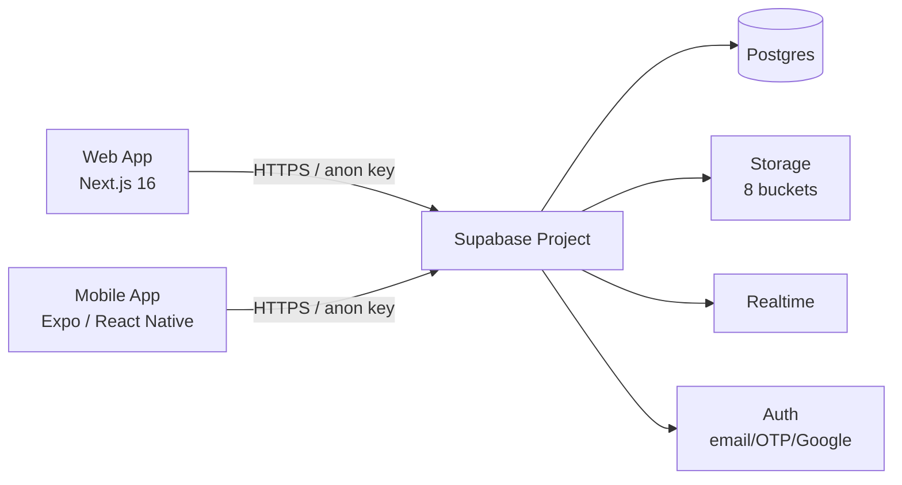
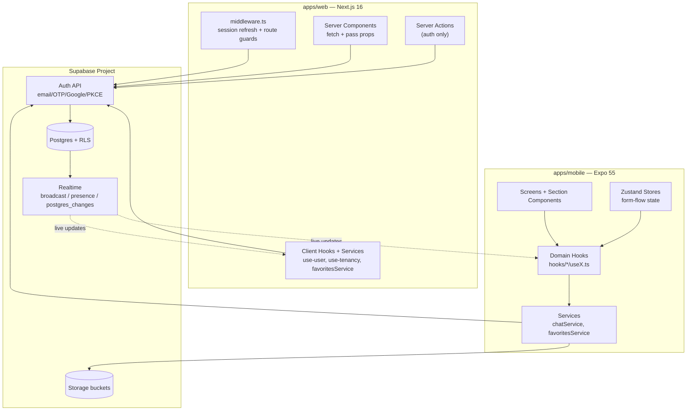
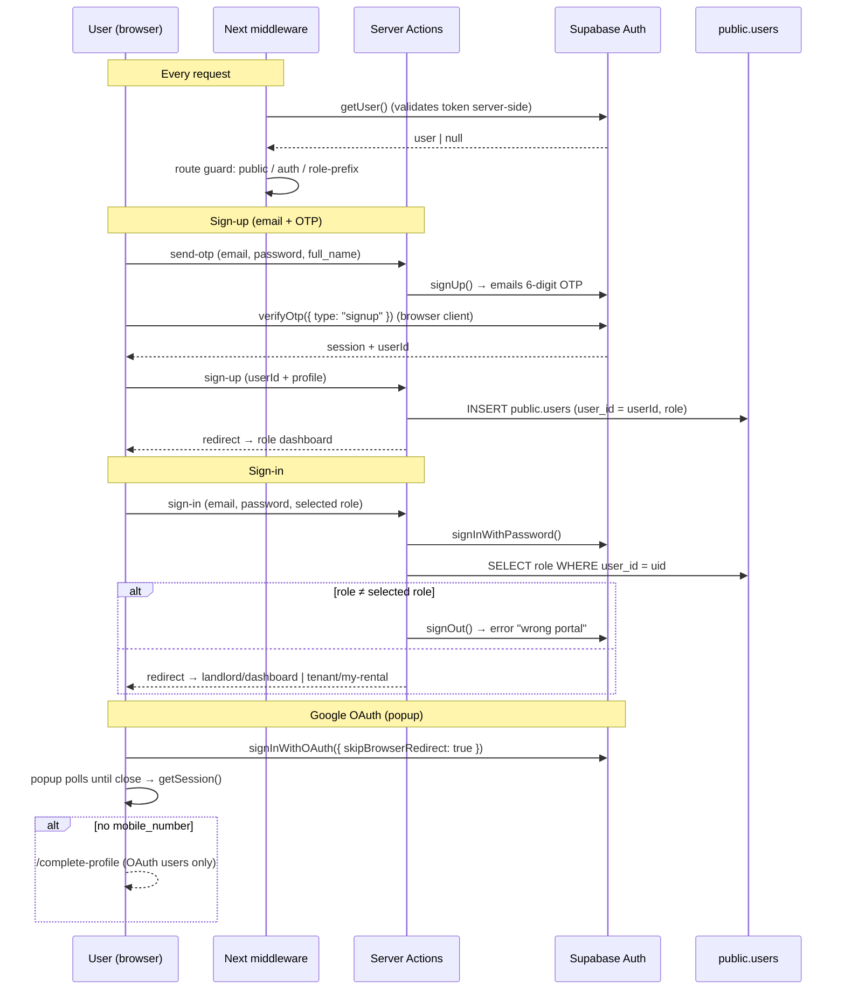
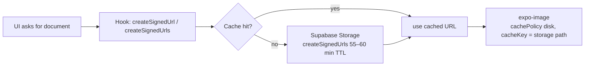
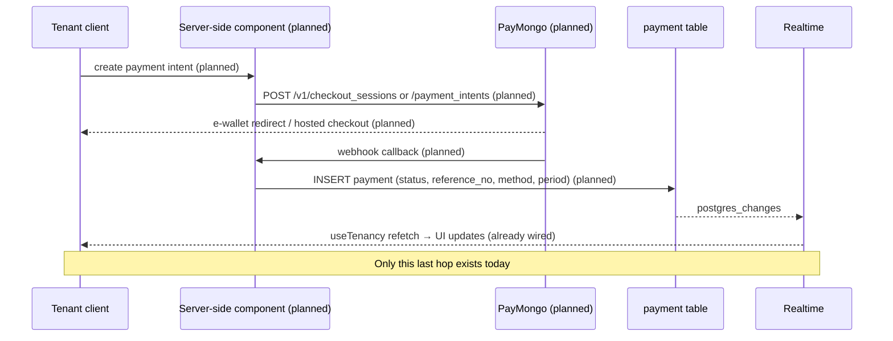
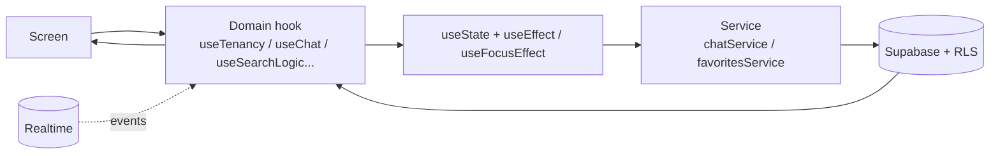
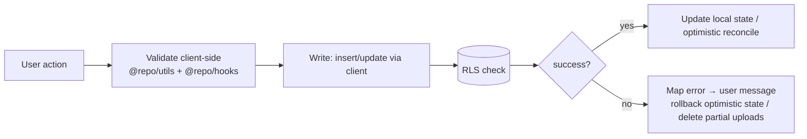

# ARCHITECTURE.md — APT (A Place to Thrive)

The authoritative description of how APT works as a software system: how the repository is organized, how data flows, how the platform's subsystems (auth, payments, chat, storage, realtime) work, and where new features should integrate.

Document hierarchy:

| Document | Scope |
|---|---|
| **ARCHITECTURE.md** (this file) | How the system works — structure, flows, subsystems |
| **AGENTS.md** | Engineering conventions — how to write code here |
| **DESIGN.md** | Visual design — how the UI should look |
| **design-tokens.json** | Design tokens consumed by the apps |

Every architectural claim in this document was verified against the repository at the time of writing. Where a claim could not be verified — or does not exist — it is explicitly marked **Not currently implemented** or **Could not be verified**. This document describes the system as it is, not as intended; planned behavior is confined to §7.2 and §22 and is always labeled.

---

## 1. System Overview

APT is a rental management platform for the Philippine market (CAMANAVA area focus). It connects **tenants** (students and renters) with **landlords** (property owners): tenants browse listings, apply, visit, chat, pay rent, and file maintenance requests; landlords publish units, manage applications, visits, payments, and maintenance. An **admin** role exists only as a middleware guard and has no UI or feature implementation.



**Architectural style.** Backend-as-a-service. There is **no custom application server**: both clients speak to Supabase directly (PostgREST, Auth, Realtime, Storage). Authorization is enforced database-side via Row Level Security (RLS); the clients use only the public anon key. There are no API routes on web (`apps/web/app/api/` does not exist), no Supabase Edge Functions, and no migrations in the repository (see §5).

**Major technologies.**

| Layer | Technology |
|---|---|
| Web | Next.js 16 (App Router), React 19, Tailwind CSS v4, HeroUI v3 + shadcn/ui, Leaflet |
| Mobile | Expo 55 (React Native 0.83), Expo Router, Uniwind, HeroUI Native v3, Zustand |
| Backend | Supabase: Postgres, Auth (PKCE), Realtime, Storage |
| Monorepo | pnpm 10 workspaces (`apps/*`, `packages/*`), Node 22 |

**Users and platforms.**

| User | Web | Mobile |
|---|---|---|
| Tenant | browse, favorites, my-rental (view-only), messages | full tenant experience (search, apply, visit, pay UI, maintenance, chat) |
| Landlord | dashboard (dummy data), properties CRUD, messages | full landlord experience (units, applications, visits, maintenance, analytics, chat) |
| Admin | not implemented (role exists in middleware only) | — |

---

## 2. Repository Structure

```text
apt-rental-platform/
├── apps/
│   ├── web/        # Next.js 16 marketing + product UI
│   └── mobile/     # Expo 55 React Native app (iOS/Android)
├── packages/
│   ├── constants/  # Domain constants + PH address data (@repo/constants)
│   ├── hooks/      # Shared React validation hooks (@repo/hooks)
│   ├── supabase/   # Supabase clients + generated DB types (@repo/supabase)
│   └── utils/      # Shared pure utilities (@repo/utils)
├── supabase/       # Supabase CLI artifacts ONLY (.temp/) — no migrations
├── graphify-out/   # Knowledge graph for AI navigation (see §24)
├── AGENTS.md       # Engineering conventions
├── DESIGN.md       # Visual design system
└── design-tokens.json
```

**Monorepo philosophy.** Shared, platform-agnostic logic lives in `packages/`; anything platform-specific stays inside `apps/`. Apps may depend on packages; packages never depend on apps. There is no shared UI package — components are duplicated per platform by design (DESIGN.md governs visual parity).

**Why each package exists.**

| Package | Exists because |
|---|---|
| `@repo/supabase` | Both apps need Supabase clients with **different session storage** (cookies on web, AsyncStorage on mobile) plus one generated type source for the database (`Database`) so queries are type-checked on both platforms |
| `@repo/constants` | Domain values (apartment types, payment statuses, PH provinces/cities/barangays, postal codes, user attributes) must be identical across platforms and are far too large to duplicate |
| `@repo/utils` | Pure formatting/validation (PHPeso display, PH addresses, card validation, relative time) reused by both apps |
| `@repo/hooks` | Validation hooks for PH phone numbers, postal codes, and password strength — duplicated logic that started on mobile and is available to web |

**Notable absences.** No `apps/web/app/api/` routes, no `supabase/migrations/`, no `supabase/functions/`, no tests, no CI, no formatter config. The database schema lives only in the linked Supabase project; the repo's reference for it is the generated types in `packages/supabase/src/types.ts`.

---

## 3. High-Level Architecture



**Web.** Next.js middleware (`apps/web/middleware.ts`) delegates to `@repo/supabase/middleware` (`updateSession`): it refreshes the session cookie and enforces route guards on every request. Server pages fetch data with `@repo/supabase/server` and pass plain props to `"use client"` children. Mutations are rare: the only server actions are the six auth actions in `app/(auth)/actions/`. All other reads/writes run client-side through `@repo/supabase/browser` (a singleton `createBrowserClient` from `@supabase/ssr`), trusting RLS.

**Mobile.** Screens compose section components; domain hooks (`hooks/<domain>/useX.ts`) own fetching/state; `service/chatService.ts` and `service/favoritesService.ts` are stateless Supabase operations. Zustand stores hold only multi-step form-flow state (see §11). All Supabase access goes through the `@repo/supabase` default client, which branches between React Native (PKCE + AsyncStorage) and web environments.

**Interaction with services.**

| Service | Used by | Purpose |
|---|---|---|
| Postgres + RLS | both | All business data; final authorization authority |
| Auth | both | Sessions, email/OTP signup, Google OAuth, PKCE |
| Realtime | both | Live chat delivery/typing; live payment/tenancy updates |
| Storage | both | Images, lease agreements, documents, chat attachments |

---

## 4. Authentication Architecture

### 4.1 Stack

| Aspect | Web | Mobile |
|---|---|---|
| Client | `@supabase/ssr` via `@repo/supabase/server` / `/browser` | `@repo/supabase` default client (`packages/supabase/src/client.ts`) |
| Session storage | Cookies (HTTP-only SSR pattern) | AsyncStorage |
| Flow type | Implicit (cookie) | **PKCE** (`flowType: "pkce"`) |
| Auto-refresh | Middleware refreshes/rotates tokens on request | `autoRefreshToken: true` |
| Providers | Email/password + OTP, Google OAuth (popup) | Email/password + OTP, Google OAuth (in-app browser, PKCE) |
| Role enforcement | Middleware (route prefixes) + server pages | Bootstrap redirect (`app/index.tsx`) + `(tabs)/_layout.tsx` guard |

The mobile client (packages/supabase/src/client.ts:38) is the platform-aware one: it resolves `EXPO_PUBLIC_*` (fallback `NEXT_PUBLIC_*`) and injects AsyncStorage as the auth storage when running in React Native; `detectSessionInUrl` is enabled only outside RN (web builds). The web app is expected to use `@repo/supabase/server` / `/browser` instead (per AGENTS.md); note that `hooks/use-user.ts` and `hooks/use-tenancy.ts` currently import the root default client anyway — see §21 debt D7.

### 4.2 Identity model

Supabase `auth.users` is the canonical identity (email, password, OAuth). Each signup also creates a row in `public.users` with:

- an internal UUID primary key `id`
- `user_id` referencing `auth.users.id` (`auth.uid()`)
- `role` — `'tenant'` or `'landlord'`
- profile fields (name, gender, birth date, mobile number, PH address, postal code)

**All RLS policies and foreign keys in the database reference the internal `public.users.id`, not `auth.uid()`.** Client code therefore resolves the internal id on every profile-dependent query:

```sql
(SELECT id FROM public.users WHERE user_id = auth.uid())
```

Both platforms resolve this in hooks: `users.select(...).eq('user_id', user.id)` (e.g. `apps/mobile/hooks/auth/useProfile.ts`, `apps/web/hooks/use-user.ts`).

### 4.3 Web flow



Key files: `apps/web/app/(auth)/actions/{send-otp,sign-up,sign-in,sign-out,complete-profile,check-email-availability}.ts` (the only server actions in the app), `apps/web/app/auth/callback/route.ts` (OAuth code exchange; handles `popup=true`, role sync, and the `/complete-profile` branch), `apps/web/app/(auth)/sign-up-form/hooks/useOtpFlow.ts` (browser-side OTP verify with 120s resend cooldown).

**Route guards** (packages/supabase/src/middleware.ts): a public-route allowlist (note: includes `/help`, `/contact`, `/safety`, `/faq` for which no routes exist — debt D12); signed-out users on non-public routes → `/sign-in`; signed-in users on `/sign-in`, `/sign-up`, `/sign-up-form` → `/`; role-prefix protection maps `tenant → /tenant`, `landlord → /landlord`, `admin → /admin` and redirects to the user's own first route on mismatch. Server actions bypass middleware (`next-action` header check). `auth/users` row queries in middleware run through RLS.

**Session context.** There is **no global session React context** on web. `app/(auth)/components/AuthContext.tsx` is a form-state context scoped to the `(auth)` route group (type, role, email, password, error, loading). Session awareness comes from `hooks/use-user.ts` (auth user + profile, subscribes to `onAuthStateChange`) and from server pages calling `getUser()` directly.

### 4.4 Mobile flow

```mermaid
sequenceDiagram
    participant U as User
    participant S as Screen
    participant H as useGoogleAuth / hooks
    participant A as Supabase Auth (PKCE)
    participant DB as public.users

    Note over U,A: Sign-up (email + OTP)
    U->>S: complete-profile fields + password
    S->>A: signUp() → OTP email; data staged in useRegistrationStore
    U->>S: enter 6-digit code
    S->>A: verifyOtp({ type: "signup" })
    S->>DB: INSERT public.users (user_id, role, profile)
    S->>S: store.reset(); route by role

    Note over U,H: Google OAuth (PKCE + in-app browser)
    U->>H: sign in with Google
    H->>A: signInWithOAuth({ redirectTo: Linking URL auth/callback })
    H->>H: WebBrowser.openAuthSessionAsync(url, redirectTo)
    H->>A: exchangeCodeForSession(code) (deep-link listener)
    H->>DB: read role / mobile_number
    alt new user or incomplete profile
        U->>S: auth-complete-profile → update user + users row
    end
```

Key files: `apps/mobile/app/_layout.tsx` (crypto polyfill for PKCE via `expo-crypto`, `WebBrowser.maybeCompleteAuthSession()`), `apps/mobile/app/index.tsx` (first-launch onboarding gate + `onAuthStateChange` bootstrap that routes by DB role), `apps/mobile/app/(tabs)/_layout.tsx` (the only role-guard layout: redirects landlord ↔ tenant tabs), `apps/mobile/hooks/auth/useGoogleAuth.ts`, `apps/mobile/stores/useRegistrationStore.ts`.

**Session handling.** Sessions persist in AsyncStorage (`persistSession: true`). The bootstrap listener in `app/index.tsx` decides landlord vs tenant entry. Deep screens (`apartment/`, `chat/`, `settings/`) are not guarded client-side; they rely on RLS server-side — unauthenticated writes fail at the database.

**User creation.** Signup (both platforms) is a two-step commit: `auth.signUp()`/`verifyOtp()` creates the auth user, then the client inserts the `public.users` row. Failure handling differs: mobile signs out if the profile insert fails (to avoid an authed-but-profiless state); web maps the unique-violation error (23505) to "account already exists". OAuth users who lack `mobile_number` are routed to a `complete-profile` screen on both platforms.

---

## 5. Database Architecture

**Schema location.** The schema exists only in the linked Supabase project (ref `ezxirkpgfpripjydcqnt`). **There are no migrations, seed files, or DDL in this repository** (`supabase/` contains only CLI `.temp/` artifacts). The repository's de-facto schema reference is the generated type file `packages/supabase/src/types.ts` (960 lines), which defines every table, column, and foreign key. Schema changes are made directly in the Supabase dashboard/CLI against the live project, then the types are regenerated.

**Tables** (from `types.ts`): `apartments`, `apartment_images`, `users`, `tenancies`, `rental_application`, `payment`, `maintenance_request`, `visit_request`, `favorites`, `reviews`, `chat` — plus one RPC, `get_conversations`.

### 5.1 Patterns

- **Internal ID indirection.** `users` has `user_id` (→ `auth.uid()`) and internal `id` (UUID PK). Every FK — `apartments.landlord_id`, `tenancies.tenant_id/landlord_id`, `chat.sender_id/receiver_id`, `payment.tenant_id`, `favorites.tenant_id`, `reviews.tenant_id`, etc. — points at the internal `id`. Joins to `users` must disambiguate by FK name (e.g. `users!tenancies_tenant_id_fkey`) because tables often have multiple FKs to `users` (chat, reviews, tenancies).
- **RLS philosophy.** RLS is the final authority; clients use only the anon key, so every query is filtered by the user's internal id (`(SELECT id FROM public.users WHERE user_id = auth.uid())`). Individual policies are not in the repo and **could not be verified here**.
- **Soft deletes.** `apartments.deleted_at` is set instead of deleting rows; queries filter `.is("deleted_at", null)`.
- **String statuses, not enums.** Statuses (`apartments.status`, `payment.status`, application/maintenance/visit statuses) are `text` columns. Observed value usage is inconsistent across the codebase (e.g. `'paid'` vs `'not paid'`, `'pending'` vs `'Pending'`) — see §21 debt D8.
- **Read-side aggregation columns.** `apartments` carries denormalized counters (`no_favorites`, `no_ratings`, `average_rating`).
- **Chat has no conversations table.** A conversation is derived: an ordered pair of users plus `apartment_id` (nullable). Conversation lists come from the `get_conversations` RPC (see §8).
- **Payment rows are written nowhere in the codebase.** The `payment` table (amount, method, status, date, due_date, period_start/end, `reference_no`, `proof_url`) is only ever read (see §7).

---

## 6. Storage Architecture

**Buckets** — verified bucket names and their treatment in code:

| Bucket | Access | Contents | Read pattern |
|---|---|---|---|
| `apartment-images` | Public | Apartment photos | `getPublicUrl`; **inconsistently** also signed (debt D5) |
| `avatars` | Public | Profile photos | `getPublicUrl` (+ `?t=` cache-bust) |
| `background_photos` | Public | Profile background | `getPublicUrl` |
| `review-images` | Public | Review photos | `getPublicUrl` |
| `lease-agreements` | Private | Lease PDFs | `createSignedUrl(s)` |
| `application-documents` | Private | Gov ID, proof of income/billing, NBI | `createSignedUrls` |
| `chat-images` | Private | Chat images/videos/GIFs (+ thumbnails) | `createSignedUrls` (batch) |
| `maintenance-images` | Private | Maintenance photos | `createSignedUrls` |

### 6.1 Path conventions

| Bucket | Pattern | Writes |
|---|---|---|
| `apartment-images` | `{apartmentId}/{ts}-{rand}.{ext}` (web) · `thumbnails/…`, `additional/…` (mobile publish) · `apartments/{apartmentId}/cover_{ts}.{ext}`, `photo_{ts}.{ext}` (mobile manage) | web + mobile; `upsert: true` in manage |
| `lease-agreements` | `{apartmentId}/lease-agreement.{ext}` · `{apartmentId}/{ts}-{rand}.{ext}` (web) | web + mobile |
| `application-documents` | `{tenantId}/{applicationId}/{docKey}-{ts}.{ext}` | mobile only |
| `chat-images` | `{senderId}/{id}.{ext}` · `{senderId}/thumb-{id}.jpg` | mobile only |
| `avatars` / `background_photos` | `{userId}/{userId}.{ext}` (upsert) | mobile only |
| `review-images` | `{tenantId}/{reviewId}/{ts}-{rand}.{ext}` | mobile only |
| `maintenance-images` | `{tenantId}/{ts}-{file.name}` | mobile only |

### 6.2 Upload flow

1. Client picks/validates the asset (per-file size caps: 25 MB chat; quality/compression on pick).
2. Client uploads directly to the bucket with the anon key (storage is RLS-protected; uploads are scoped by bucket policies).
3. Client stores **either** the storage path (private buckets) **or** a public URL from `getPublicUrl` (public buckets) in the relevant DB column; signed URLs are never persisted.
4. On failure, some flows roll back (application documents delete all uploaded files; review photos clean up; web property-create deletes the apartment row) — others do not (chat attachments, apartment publish, maintenance) — see §21 debt D9.

### 6.3 Download flow (private buckets)



- **Expiration**: signed URLs are created with 55–60 minute TTLs.
- **Caching**: module-level `Map` caches exist in `useDocumentUrls`, `useLandlordMaintenanceRequests`, `useLandlordVisitRequests`, and lease-agreement reads (`useApartmentDetails`, `current-apartment.tsx` — cache refreshed 5 min before expiry); others regenerate on every fetch (debt D4). `expo-image` uses `cachePolicy="disk"` and, in chat, a `cacheKey` derived from the storage path so re-signed URLs don't re-download (ChatBubble).
- **Public buckets** are read straight from stored URLs.

### 6.4 Deletion

- Apartment photos: explicit remove on edit (web modal, mobile manage) with cover promotion.
- Lease agreements: replace = upload new → update DB → remove old; delete = null DB → remove file.
- **Property delete is a soft delete** (`deleted_at`) and **does not clean up storage** (debt D9).
- Chat attachments and maintenance images are never deleted.

---

## 7. Payment Architecture

> **Important.** APT does **not** process payments today. What exists is (a) a complete but mock payment UI on mobile, (b) read-only display of `payment` table rows, and (c) a database table designed for a future payment flow. PayMongo appears exactly once in the codebase, as a marketing string. There is no PayMongo SDK, no payment API key, no webhook, no server-side payment code, and no code path that writes a payment.

### 7.1 Current architecture (verified, implemented)

```mermaid
sequenceDiagram
    actor T as Tenant
    participant C as payment/index.tsx
    participant R as e-wallet-redirect.tsx
    participant S as success.tsx
    participant DB as payment table

    Note over T,DB: All values hardcoded (apartment, rent, due date, landlord)
    T->>C: choose method (GCash / Maya / Card / Cash)
    alt GCash or Maya
        C->>R: router.push(e-wallet-redirect?method=…)
        R->>S: router.push(success)  ← no provider call
    else Card
        C->>C: validateCardInfo() (Luhn, expiry, CVV)
        C->>S: router.push(success)  ← no tokenization
    else Cash
        C->>C: validateCashPayment()
        C->>S: router.push(success)
    end
    S->>S: build receipt from hardcoded data; ref = 'APT-' + base36 timestamp
    Note over S,DB: Receipt not persisted; no DB write
```

**What exists:**

| Piece | Status | Evidence |
|---|---|---|
| Mobile payment screens (method selection, card/cash forms, e-wallet redirect, success/failed, history, saved-methods) | Implemented, **mock data** | `apps/mobile/app/tenant/payment/*` |
| Receipt generation | Client-only, hardcoded (apartment "Sunny Apartments", method forced `'GCash'`), not persisted | `apps/mobile/app/tenant/payment/success.tsx`, `components/ReceiptCard.tsx` |
| Card validation | Real (Luhn, expiry, CVV) | `packages/utils/src/validateCardNumber.ts` |
| E-wallet redirect | Mock — `router.push` only; no `WebBrowser`, no URL, no deep link | `apps/mobile/app/tenant/payment/e-wallet-redirect.tsx` |
| Saved payment methods | UI stubs; `hasSavedPaymentMethod` hardcoded false; add/delete no-ops | `apps/mobile/app/tenant/payment/saved-methods/*` |
| Payment history (mobile) | Hardcoded dummy records (`// Dummy data for payment history`) | `apps/mobile/app/tenant/payment/history.tsx` |
| `payment` table reads | Real — 5 read queries (tenant current payment, landlord history, monthly profit, web tenant history) | `hooks/tenancy/useTenancy.ts`, `hooks/tenancy/useLandlordTenancy.ts`, `hooks/apartments/useLandlordUnits.ts`, `apps/web/hooks/use-tenancy.ts` |
| Realtime on payments | `tenancy-live` subscription on `payment`/`tenancies` → full refetch (only write-anticipating wiring) | `apps/mobile/hooks/tenancy/useTenancy.ts` |
| Web landlord payments | Placeholder page ("Add your payments management UI here") | `apps/web/app/landlord/payments/page.tsx` |
| Web tenant pay | Confirmation modal only; `onConfirm` ends in `// TODO: trigger Supabase payment flow` | `apps/web/app/tenant/my-rental/components/PaymentModal.tsx` + `page.tsx` |
| PayMongo | One UI string only ("securely processed by PayMongo") | `apps/mobile/app/tenant/payment/saved-methods/card-form.tsx` |
| Webhooks / API routes / Edge Functions / payment keys | **Not currently implemented** | no `app/api`, no `supabase/functions`, no `PAYMONGO_*` env vars |

### 7.2 Planned architecture (evidence-based; **NOT IMPLEMENTED**)

The following intended design is inferred from the `payment` table schema, `PAYMENT_STATUS` constants, card-validation utils, and in-code TODOs. **None of it runs today.**



- `payment` schema (amount, method, status, date, due_date, period_start/end, `reference_no`, `proof_url`, FKs to apartment/tenancy/tenant) already matches this flow.
- The `tenancy-live` realtime subscription in `useTenancy` already reacts to payment writes — the missing piece is the writer.
- Receipt would need to be generated from a persisted payment row (today it is hardcoded).
- Secret-key handling, webhook contract, and status reconciliation are **not documented** — no code exists to describe them.

---

## 8. Chat Architecture

There is no `conversations` table. A conversation is **an ordered pair of users plus an optional `apartment_id`** (an apartment-scoped thread is an inquiry; a non-apartment thread is a tenancy thread). Conversation metadata is served by the `get_conversations` RPC; message rows live in `chat` (`sender_id`, `receiver_id`, `apartment_id`, `message`, `message_type`, `is_read`, `read_at`, `group_id`, timestamps).

```mermaid
flowchart LR
    subgraph Mobile["Mobile (apps/mobile)"]
        MC[(chat rows)] --> LS[Chat list tabs<br/>postgres_changes chat-list:myId]
        CONV[Conversation screen<br/>useChat]
        CONV --> BC[Broadcast channel<br/>chat:msg:{key}]
        CONV --> PC[Presence channel<br/>chat:presence:{key}]
    end
    subgraph Web["Web (apps/web)"]
        WC[(chat rows)] --> MSG[MessageClient<br/>unread channel tenant/landlord-unread:{id}]
        CV[ConversationView] --> PC2[presence + postgres_changes<br/>conversation:{sortedIds}]
    end
    BC -. new_message event .-> CONV
    PC -. typing .-> CONV
    PC2 -. typing .-> CV
```

### 8.1 Conversation keys

Two key formats coexist — **this is a verified inconsistency** (debt D3):

| Format | Used by | Shape |
|---|---|---|
| Realtime channel key | Mobile `useChatChannel` | `chat:{apartmentId\|'none'}:{sortedUserIds}` (IDs sorted so both sides agree) |
| RPC / route key | `get_conversations`, chat-list screens, **web** | `{otherUserId}:{apartmentId\|'none'}` |

### 8.2 Mobile conversation screen

- **Fetch**: full message history for the pair (both directions via `.or()`), ascending; **no pagination** (debt D2).
- **Delivery**: broadcast channel `chat:msg:{key}` with event `new_message`; the sender pushes after a successful insert; receiver filters own echoes and apartment matches, and dedupes by message id. (Mobile does **not** use `postgres_changes` in the conversation screen.)
- **Typing**: presence channel `chat:presence:{key}` keyed by user id; 2 s idle timer + 4 s heartbeat (`useChatTyping`); typing state considered fresh for 5 s.
- **Optimistic sends**: text messages get a `temp-{ts}` id and a "Sending…" bubble; replaced in place by the server row, rolled back (text restored to input) on error.
- **Attachments**: `expo-image-picker` (images/videos, 10 max, 60 s video cap); staged previews; **3-concurrent worker-pool uploads** to `chat-images` (25 MB cap); video thumbnails via `expo-video-thumbnails`; batch insert with a shared `group_id`; per-file failures filtered out; GIFs (Giphy SDK) downloaded to cache then uploaded as regular `image/gif` attachments (debt D10).
- **List**: inverted `FlatList` (newest first) with `maintainVisibleContentPosition`, auto-scroll-to-bottom within 150 px threshold, scroll-to-bottom button; no virtualization beyond FlatList defaults.
- **Statuses**: `is_read` boolean set on open/read; **no delivered/read receipts**; `read_at` is written on web but never on mobile.
- **Teardown**: channels removed on unmount.

### 8.3 Web messages

- **Contacts & unread**: computed server-side in `page.tsx` (unread counts keyed `{senderId}:{apartmentId|'none'}`), passed as props to the client `MessageClient`.
- **Unread badge**: `postgres_changes` INSERT on `chat` filtered `receiver_id=eq.me` on channels `tenant-unread:{id}` / `landlord-unread:{id}`.
- **Live conversation**: `postgres_changes` INSERT filtered `sender_id=eq.contact` on channel `conversation:{sortedIds}` (no apartment in the name) + presence for typing (no heartbeat).
- **Sending**: optimistic insert with `crypto.randomUUID()`; text only — **no attachments, no GIFs on web**.
- Both tenant and landlord variants are near-identical (one file each for the shared conversation view; `browse/[apartmentId]/LandlordChatPanel` reuses the tenant `ConversationView`).

### 8.4 Attachments lifecycle (mobile only)

Pick → stage (local URI preview) → upload (worker pool, `chat-images/{senderId}/{id}.{ext}` + `thumb-{id}.jpg`) → batch DB insert → batch signed URLs (60 min) → render via `expo-image` (disk cache, `cacheKey` = storage path) / `expo-video` modal. **Attachments are never deleted**; signed URLs are regenerated on every open (debt D4); no refresh-on-expiry while the screen stays open (debt D4).

---

## 9. Realtime Architecture

Complete inventory of every Realtime subscription in the codebase (verified — 7 unique channels, 13 event bindings):

| # | Channel | Type | Table / Event | Filter | Purpose | Where |
|---|---|---|---|---|---|---|
| 1 | `chat:msg:{key}` | broadcast | event `new_message` | client-side (own-echo skip, apartment match) | Live message delivery (mobile conversation) | `apps/mobile/hooks/chat/useChatChannel.ts` |
| 2 | `chat:presence:{key}` | presence | `sync`/`join`/`leave` | keyed by `presence.key = userId` | Typing indicators (mobile) | `apps/mobile/hooks/chat/useChatChannel.ts` |
| 3 | `chat-list:{myId}` | postgres_changes | `chat` INSERT | none (client checks membership) | Reorder/refresh conversation lists | `apps/mobile/app/(tabs)/(tenant)/chat.tsx`, `(landlord)/chat.tsx` |
| 4 | `tenancy-live` | postgres_changes | `payment` INSERT/UPDATE/DELETE + `tenancies` (all events, unfiltered) | payment filtered by `tenancy_id` client-side | Live payment/tenancy updates | `apps/mobile/hooks/tenancy/useTenancy.ts` |
| 5 | `conversation:{sortedIds}` | postgres_changes + presence | `chat` INSERT (+ presence `sync`) | `sender_id=eq.contact` | Live messages + typing (web) | `apps/web/app/{tenant,landlord}/messages/components/ConversationView.tsx` |
| 6 | `tenant-unread:{currentUserId}` | postgres_changes | `chat` INSERT | `receiver_id=eq.me` | Unread badges (web) | `apps/web/app/tenant/messages/components/MessageClient.tsx` |
| 7 | `landlord-unread:{currentUserId}` | postgres_changes | `chat` INSERT | `receiver_id=eq.me` | Unread badges (web) | `apps/web/app/landlord/messages/components/MessageClient.tsx` |

Patterns:

- **Delivery model**: mobile chat uses broadcast (push after DB insert); web chat uses `postgres_changes`. Both require Realtime publication config in the live project (not visible in the repo).
- **Updates**: no `UPDATE`/`DELETE` subscriptions anywhere except the `*` event on `payment`/`tenancies` in `tenancy-live`.
- **Optimistic behavior**: chat send is optimistic with rollback (§8.2); realtime then reconciles. Payments/tenancy are not optimistic — realtime triggers a full refetch.
- **Absent**: no storage-bucket realtime, no presence outside chat, nothing in `packages/`.

---

## 10. Shared Packages

### `@repo/supabase`

- **Exports**: `.` (default `supabase` client — RN-aware, branches PKCE/AsyncStorage vs web; plus `createBrowserClient`, `Database`, `Json` types) · `./browser` (singleton `createBrowserClient` from `@supabase/ssr`) · `./server` (`createServerClient` with Next cookies) · `./middleware` (`updateSession` — web route guards).
- **Deps**: `@supabase/supabase-js`, `@supabase/ssr`; optional peers `next`, `react-native`, `async-storage`.
- **When to use**: mobile everywhere; web server pages/actions → `./server`; web client components/hooks → `./browser`; web middleware → `./middleware`.
- **When NOT to use**: the root default export on web (per AGENTS.md it is mobile-oriented) — though `use-user.ts`/`use-tenancy.ts` still do (debt D7). Web `next.config.ts` aliases `react-native`/`async-storage` to an empty module to make the root import safe on web.

### `@repo/constants`

- **Exports**: PH address data (regions, provinces, cities, barangays, postal codes), apartment constants (types, furnished types, floor levels, lease durations, statuses, amenities, maintenance categories/urgency, payment status), user constants (gender, suffixes, valid IDs, languages, PH mobile prefixes), `COLORS`, `MONTHS`, `YEARS`, font tokens.
- **Deps**: none.
- **When to use**: any domain value or PH location option on either platform.
- **When NOT to use**: UI styling (that's `design-tokens.json` / DESIGN.md) or values that are only meaningful to one app.

### `@repo/utils`

- **Exports**: `formatPesoDisplay`, `handlePesoChange`, `formatAddress`, `formatFullName`, `formatDate`, `formatTime`, `getRelativeTime`, `getInitials`, `isValidEmail`, auth error helpers, card validation (`validateCardInfo`, Luhn, expiry).
- **Deps**: none.
- **When to use**: pure formatting/validation shared by both apps.
- **When NOT to use**: anything stateful or React-bound (that's `@repo/hooks` or app hooks).

### `@repo/hooks`

- **Exports**: `usePasswordValidation`, `usePHMobileValidation`, `usePHPostalCode`.
- **Deps**: React (peer), `@repo/constants`.
- **When to use**: mobile forms (signup, edit profile). Web declares the dependency but **never imports it** (debt D6) — validation on web lives in `sign-up-form/utils.ts` and `complete-profile.ts`.

---

## 11. State Management

| Owner | What it holds | Notes |
|---|---|---|
| **Local state** (`useState` + custom hooks) | Everything not listed below — the default | Hooks expose `{ data, loading, error, refetch }`; `useFocusEffect` refetch pattern |
| **Zustand (mobile only)** | Multi-step form-flow state | `stores/use{Registration,ApartmentForm,ApplicationForm,Personalization}Store.ts` + persisted `useThemeStore` (AsyncStorage, key `apt-theme`) |
| **Supabase** | All server data | Source of truth; fetched directly in hooks/services, never mirrored in stores |
| **URL state (web)** | Browse filters/search/pagination | `searchParams` → server page re-queries (`SearchContainer`, `FilterContainer`, `RenderApartments`) |
| **Context (web)** | Auth-form state only | `AuthContext` is scoped to `(auth)` pages; **no global session context** (see §4.3) |

Zustand stores follow `create<State & Actions>` with exported `interface`, `initialState`, and `reset()`; `reset()` is called when the flow completes or is cancelled. React Query is not used anywhere (by convention — see §21 debt D1). Favorites state is duplicated per consumer on web (each component runs its own `useFavorites`) and single-source in the mobile hook.

---

## 12. Feature Architecture

Each feature below is mobile-first; the web mirrors it where noted. "Architecture only" — no UI details.

| Feature | Mobile | Web | Backing tables |
|---|---|---|---|
| **Authentication** | §4.4 (PKCE, OTP, Google) | §4.3 (server actions, middleware, OAuth popup) | `users` |
| **Explore / Search** | `(tabs)/(tenant)/search.tsx` + `useSearchLogic` (debounced search, server pagination 10/page, 4 sort modes, filter sheet) | `browse/` server page: full filter set, `count: exact`, 25/page, Suspense-wrapped client children | `apartments`, `apartment_images` |
| **Apartment detail** | `apartment/[apartmentId]` — sections + `useApartmentDetails` (apartment + landlord + top-3 reviews) | `browse/[apartmentId]/` server page → 16 client children | `apartments`, `apartment_images`, `reviews`, `users` |
| **Rental application** | 5-step wizard (`apply/*`) with `useApplicationFormStore`, document uploads with rollback, `useSubmitApplication` | Not implemented (landlord `applications/` is a placeholder) | `rental_application`, `application-documents` |
| **Visit requests** | Tenant `request-visit` + `useSubmitVisitRequest`; landlord `visit-requests/` list/detail with actions, reschedule sheet | Not implemented | `visit_request` |
| **Tenancy / My rental** | `tenant/current-apartment.tsx` + `useTenancy` (joined tenancy+apartment+landlord+latest payment, realtime-refreshed) | `tenant/my-rental/` client page + `use-tenancy` | `tenancies`, `payment` |
| **Payments** | Mock UI flow (§7.1) | Placeholder + view-only history (§7.1) | `payment` (read-only) |
| **Maintenance** | Tenant request/history + `useSubmitMaintenanceRequest` (uploads photos); landlord `maintenance-requests/` workflow (pending → resolved) | Stub ("Coming Soon") | `maintenance_request`, `maintenance-images` |
| **Chat** | §8 (full: attachments, GIFs, typing, presence, optimistic) | §8.3 (text-only) | `chat`, `chat-images`, `get_conversations` RPC |
| **Reviews & ratings** | Detail ratings, `rate-apartment`, `useSubmitReview` (photo uploads with rollback) | Read-only display (`RatingsSection`, `RenderReviews`) | `reviews`, `review-images` |
| **Favorites** | `useFavorites` (set state + DB writes) | `useFavorites` + `favoritesService` | `favorites` |
| **Landlord units** | `(tabs)/(landlord)/units.tsx`, `manage-apartment/` (edit wizard, reviews, tenant profiles), `add-apartment/` (publish wizard with `useApartmentFormStore`) | `landlord/properties/` (list, create wizard with Leaflet map, edit modals) | `apartments`, `apartment_images`, `lease-agreements` |
| **Landlord analytics** | `landlord/analytics.tsx` | `landlord/dashboard/` — **dummy data** (debt D11) | (none) |
| **Notifications** | `(notification)/` screens backed by `useNotifications` (React Query + realtime), DB-trigger-generated rows (`create_notification`), Expo push via `push-notify` edge function, in-app HeroUI toast banner (`useInAppNotificationBanner`, realtime-driven, works without push creds), delivery gated by per-user `notification_preferences` (master + per-type, enforced in `push-notify` and the client) | Not implemented | `notifications`, `push_tokens`, `notification_preferences` |
| **Account verification** | `verify-account/`, `document-id/` (upload screen is a stub — nothing uploads) | Not implemented | — |
| **Admin** | Not implemented | Not implemented (middleware role stub only) | `users.role = 'admin'` |
| **Profile / settings** | `profile/tenant|landlord/[id]`, `edit-profile` (avatar/background upload), `settings/*` | Not implemented (navbar links are dead — debt D12) | `users`, `avatars`, `background_photos` |

---

## 13. Navigation

### Web (Next.js App Router)

- Route groups: `(auth)` (no shared layout), `(main)` (marketing, AppNavbar + Footer), `browse` (NavbarSwitcher), `forowners`, `landlord` (SidebarProvider + LandlordSidebar), `tenant` (TenantNavbar), plus non-grouped `auth/callback` and `auth/sign-out` route handlers.
- Protection is middleware-based (see §4.3); server pages additionally resolve the user and redirect (e.g. `tenant/favorites/page.tsx` guards non-tenants).
- Dynamic segments are camelCase (`[apartmentId]`); folders kebab-case.
- URL state for filters via `searchParams`; `router.push` on the client.

### Mobile (Expo Router)

- Root `Stack` (headerless) registers index, `(tabs)`, `(auth)`, `chat/[conversationId]`, `tenant`, `apartment/[apartmentId]`, `(notification)`, `settings`, `document-id`, `edit-profile`, dev screens.
- Tabs are **platform-split**: iOS uses `NativeTabs` (SF Symbols); Android uses classic `Tabs` with a floating `CustomTabBar` (pill) whose height/bottom-offset constants are consumed by list screens for padding.
- Role tabs: `(tabs)/(tenant)` (rentals, search, chat, profile) vs `(tabs)/(landlord)` (dashboard, units, chat, profile); the `(tabs)` layout redirects to the correct group by `users.role`.
- `app.json` experiments: `typedRoutes: true`, `reactCompiler: true`; scheme is `mobile` (no custom deep-link list).
- **Deep linking**: only for auth — `Linking.createURL("auth/callback")` for the Google PKCE exchange. No payment/screen deep links.
- Known stale registrations: `tenant/_layout.tsx` lists `current-lease` (no file exists) and `edit-profile` (actually at root) — debt D12.

---

## 14. Data Flow

### Server-driven (web pages)

```mermaid
flowchart LR
    U[User request] --> R[Next route (server)]
    R --> C[createServerClient via @repo/supabase/server]
    C --> S[(Supabase + RLS)]
    S --> D[Plain serializable data]
    D --> P[Client component props]
    P --> UI[UI]
```

Filters/params come from URL `searchParams`; pagination via `.range()`; counts via `count: "exact"`.

### Hook-driven (mobile + client web)



### Mutation flow (both platforms)



---

## 15. Error Handling

| Layer | Pattern |
|---|---|
| **Client hooks** | `{ data, loading, error }` state; mutations return `{ success, error }`; errors surfaced via `ErrorDialog`/`Dialog` + HeroUI `useToast`; `console.error` on unexpected failures (never silently swallowed) |
| **Server actions (web)** | Map Supabase error codes to friendly messages — `23505` (unique) → "account already exists"; "Invalid login credentials", "Email not confirmed", rate limits (429) |
| **Auth edge cases** | `AuthSessionMissingError` treated as signed-out everywhere (middleware, `use-user`, favorites service); mobile signs out if profile insert fails post-OTP; role-mismatch sign-in signs the user out |
| **Validation** | Client-side before every write (`validateCardInfo`, `usePasswordValidation`, `usePHMobileValidation`, `usePHPostalCode`, form utils); DB-side RLS is the final authority |
| **Optimistic failures** | Chat: temp bubble removed, text restored to input; attachments: per-file failures filtered, whole-batch failures remove all pending bubbles |
| **Upload rollback** | Application documents (delete all on any failure), review photos, web property create (deletes apartment row) |
| **Network** | No global offline/retry layer; loading and error states are kept separate; `useTenancy` degrades gracefully |

---

## 16. Security

- **RLS is the security boundary.** Both apps use only the public anon key; every data access is filtered by RLS in the live project. Policies are not visible in the repo (live project only).
- **Internal ID indirection** — FKs and policies resolve `auth.uid()` → `public.users.id`; new policies/joins must follow it (see AGENTS.md).
- **Private buckets + signed URLs** for lease agreements, application documents, chat attachments, maintenance images; paths (not URLs) are stored in DB; signed URLs are short-lived (55–60 min).
- **Secrets**: only `NEXT_PUBLIC_*` / `EXPO_PUBLIC_*` vars reach clients (Supabase URL/anon key, Giphy key). Env files are gitignored (`.env`, `.env*.local`); no secrets are tracked (`git ls-files` shows none). No server-side secrets exist yet (no payment keys — see §7).
- **Input validation** client-side on all user input; server-side trust is limited to Supabase + RLS (no custom server).
- **Middleware token validation** uses `getUser()` (server-validated), never `getSession()` from cookies.

---

## 17. Performance

Verified patterns in production code:

- **Image caching**: `expo-image` `cachePolicy="disk"` across 20+ components; `cacheKey` derived from the storage path in chat so re-signed URLs reuse the cache.
- **Signed-URL caching**: module-level `Map` caches with ~55 min TTL in `useDocumentUrls`, `useLandlordMaintenanceRequests`, `useLandlordVisitRequests`, lease-agreement reads (refresh 5 min before expiry).
- **Virtualized lists**: `FlatList` for search results (grid/list switch, `onEndReached` pagination, pull-to-refresh), inverted chat list; web browse paginates server-side (25/page) with Suspense-wrapped children.
- **Lazy loading**: web `TenantNavbar` is dynamically imported; map components `React.memo`-wrapped; mobile screens mount video players on demand.
- **Pagination**: mobile search 10/page, web browse 25/page, landlord payment history limited; chat is **not** paginated (debt D2).
- **Optimistic UI**: chat sends update immediately, reconciled after insert.

Anti-patterns are documented in `docs/AUDIT_REPORT.md` (no request-dedup/caching layer, refetch storms on focus, duplicated profile resolution, signed-URL regeneration in chat) — see §21.

---

## 18. Dependency Rules

```mermaid
flowchart LR
    WEB[apps/web] --> C[@repo/constants]
    WEB --> U[@repo/utils]
    WEB --> S[@repo/supabase]
    WEB -.declared, unused.-> H[@repo/hooks]
    MOB[apps/mobile] --> C
    MOB --> U
    MOB --> S
    MOB --> H
    H --> C
    S --> SUP[@supabase/*]
```

- Apps may depend on packages; **packages never depend on apps**.
- Shared logic belongs in `packages/`; platform-specific code stays in `apps/`.
- Business logic lives in hooks/services, **not components**; mobile components never import the Supabase client directly.
- No shared UI package — platform UI is built on HeroUI (web) / HeroUI Native (mobile) with DESIGN.md as the parity contract.
- Allowed Supabase usage: mobile → `@repo/supabase` default client; web server → `@repo/supabase/server`; web client → `@repo/supabase/browser`; web middleware → `@repo/supabase/middleware` (root export on web is the known deviation, debt D7).
- No new state libraries (React Query) without justification; no new icon libraries (three already in use — debt D14).

---

## 19. Architectural Principles

1. **Supabase is the single source of truth** for all server data — never mirror DB state in stores.
2. **RLS is the final authority** — clients hold only the anon key; UI hiding is not security.
3. **Platform parity, mobile-first** — web mirrors mobile semantics; features are usually built mobile-first.
4. **Composition over inheritance** — screens compose small section components; hooks compose services.
5. **Shared abstractions over duplication** — validation, constants, formatting live in packages.
6. **Explicit boundaries** — UI (components) / logic (hooks, services) / data (Supabase) / policy (RLS).
7. **Minimal change** — reuse → extend → share → abstract → create (AGENTS.md decision hierarchy).
8. **Internal `users.id` indirection everywhere** — FKs, policies, joins.
9. **Private data is signed, never stored as URLs** — storage paths in DB, signed on read.
10. **Optimistic where it buys UX** — chat send; conservative everywhere else.

---

## 20. AI Integration Guide

Before touching a subsystem, read its section:

| Task | Read first |
|---|---|
| Modify auth, middleware, session handling | §4 (Authentication) |
| Change schema, queries, RLS, types | §5 (Database) + AGENTS.md Supabase Conventions |
| Storage buckets, uploads, signed URLs, caching | §6 (Storage) |
| Payments | §7 (Payment) — **Current vs Planned**, §7.1 is the only reality |
| Chat, realtime channels, attachments | §8 (Chat) + §9 (Realtime) |
| Shared logic | §10 (Shared Packages) + §18 (Dependency Rules) |
| State, stores, data flow | §11 (State) + §14 (Data Flow) |
| Routing/navigation changes | §13 (Navigation) |
| New feature placement | §12 (Feature) + §18 (Dependency Rules) |
| Mobile perf/data concerns | §17 (Performance) + `docs/AUDIT_REPORT.md` |
| Anything about "how it should look" | **DESIGN.md** (not this file) |
| Code conventions, naming, structure rules | **AGENTS.md** (not this file) |

Verification workflow: run `graphify query`/`explain` for codebase questions before searching (AGENTS.md), confirm the feature's platform parity, then implement the smallest change. After edits, run `graphify update .`.

---

## 21. Known Architectural Debt

All items below are verified against the repository. The authoritative, itemized mobile audit lives in `docs/AUDIT_REPORT.md` (6 critical, 13 medium, 8 minor as of 2026-07-26); items unique to this document are marked *(this doc)*.

| # | Debt | Detail | Evidence |
|---|---|---|---|
| D1 | **No data-caching/dedup layer** | Every fetch is `useState`+`useEffect`/`useFocusEffect`; focus refetches fire full queries; React Query deliberately absent | AUDIT C1, C6 |
| D2 | **Chat has no pagination** | Full history fetched per open; unbounded `chat` selects | AUDIT C3; `chatService.fetchMessages` |
| D3 | **Two conversation-key formats** | Mobile realtime `chat:{apt\|none}:{sortedIds}` vs RPC/web `{otherId}:{apt\|none}`; mobile conversation screen ignores the route `conversationId` | `chatService.buildConversationKey` vs web pages |
| D4 | **Signed-URL caching is inconsistent** | Chat regenerates all URLs per open; no cache in `useMaintenanceRequests`/`useTenantApplications`; no refresh on 1 h expiry | AUDIT C2, M3, M4, M10 |
| D5 | **`apartment-images` public/private inconsistency** | Publish stores public URLs; visit-requests signs them; detail reads raw URLs | AUDIT C5 |
| D6 | **`@repo/hooks` unused on web** | Declared in web `package.json`, never imported; validation duplicated in `sign-up-form/utils.ts` | *(this doc)* |
| D7 | **Web uses the mobile-oriented root client** | `use-user.ts`, `use-tenancy.ts` import `@repo/supabase` default (RN-aware) instead of `/browser`; requires `next.config.ts` empty-module aliases for RN deps | *(this doc)* |
| D8 | **Status values are inconsistent strings** | `'paid'`/`'not paid'`/`'Partial'`/`'Pending'` variants across code; `PAYMENT_STATUS` constants are display-level | *(this doc)* |
| D9 | **Orphaned storage objects** | Property delete is soft and never cleans storage; chat/maintenance attachments never deleted; some upload failures don't roll back (publish, chat batch) | *(this doc)* |
| D10 | **GIFs re-uploaded** | Giphy URL downloaded → uploaded to `chat-images` → downloaded again by recipients | AUDIT M8 |
| D11 | **Web dashboard is dummy data** | `landlord/dashboard` hardcoded; `landlord/payments` and `applications` placeholders; `tenant/maintenance` stub | *(this doc)* |
| D12 | **Dead routes & links** | Web navbar links to `/profile`, `/settings`, `/my-rental`; forgot-password link; middleware allows `/help`, `/contact`, `/safety`, `/faq` (no routes); mobile `tenant/_layout` registers missing `current-lease`; playground links broken payment path | *(this doc)* |
| D13 | **Push requires EAS credentials** | `push-notify` edge function + `expo-notifications` are wired, but APNs/FCM credentials are not uploaded to EAS, so push delivery is unverified on devices | `eas credentials` |
| D14 | **Mixed icon/UI ecosystems** | Web: `@tabler/icons-react` + `lucide-react` + `react-icons`; mobile: legacy `lucide-react-native` alongside `@tabler/icons-react-native`; HeroUI + shadcn coexisting on web | AGENTS.md + *(this doc)* |
| D15 | **`public.users` role queries in middleware** | Middleware hits `users` per protected request (needs index; RLS applies) | `packages/supabase/src/middleware.ts:117` |
| D16 | **Duplicate profile resolution** | "get auth user → resolve users.id" independently implemented in 18+ locations (mobile) | AUDIT C4 |
| D17 | **No migrations in repo** | Schema is cloud-only; generated types are the only repo reference; schema changes are untracked | *(this doc)* |
| D18 | **Payments are mock** | Full §7.1 — no provider integration, no writes, hardcoded data | *(this doc)* |

---

## 22. Future Architecture

Mostly **Not documented** — the repository contains no architecture plans beyond the following verified signals:

- **Payments (§7.2)**: the `payment` schema, `tenancy-live` realtime wiring, and `// TODO: trigger Supabase payment flow` imply a provider-backed flow (PayMongo mentioned in UI copy) with a server-side writer and webhook — **not implemented**.
- **Admin role**: middleware maps `admin → /admin` with no routes or UI — a forward-looking stub, nothing more.
- **Audit recommendations**: `docs/AUDIT_REPORT.md` recommends adopting React Query, paginating chat, and consolidating signed-URL caching. These are recommendations only; **no decision or migration is documented in the repo**.
- Everything else: **Not documented.**

---

## 23. Glossary

| Term | Meaning |
|---|---|
| **Tenant** | Renter user; role `'tenant'` in `users`. |
| **Landlord** | Property owner user; role `'landlord'` in `users`. |
| **Internal user ID** | `public.users.id` — the UUID primary key used by every FK and RLS policy; distinct from `user_id` (→ `auth.uid()`). |
| **Tenancy** | Active relationship between a tenant, a landlord, and an apartment (`tenancies`); drives my-rental/current-apartment and payment display. |
| **Rental application** | Tenant's application to a unit (`rental_application`), with documents stored in `application-documents`. |
| **Visit request** | Request to view a property (`visit_request`), optionally tied to an application. |
| **Lease agreement** | PDF stored in the private `lease-agreements` bucket; DB stores its storage path (`lease_agreement_url`). |
| **Receipt** | Payment confirmation UI (GCash-style); currently generated client-side from mock data — not a persisted record (§7.1). |
| **Maintenance request** | Tenant-reported issue (`maintenance_request`) with photos in `maintenance-images`; landlord resolves it. |
| **Storage path** | Object key inside a bucket (e.g. `{tenantId}/{applicationId}/{docKey}-…`); stored in DB instead of URLs for private assets. |
| **Signed URL** | Short-lived (55–60 min) authorized URL for a private-bucket object; generated on read via `createSignedUrl(s)`. |
| **Conversation key** | Identifies a chat thread; two formats exist — mobile realtime `chat:{apt\|none}:{sortedIds}` and RPC/web `{otherId}:{apt\|none}` (D3). |
| **PKCE** | Proof Key for Code Exchange — OAuth flow used by mobile sign-in (Supabase `flowType: "pkce"`). |
| **group_id** | Batch id tying multiple chat attachment rows into one visual cluster. |
| **RLS** | Row Level Security — Postgres policies that are the platform's authorization boundary. |

---

## 24. References

| Source | Relationship to this document |
|---|---|
| **AGENTS.md** | Engineering conventions: file structure, naming, hooks/stores patterns, Supabase conventions (internal-id rule, storage paths), commands, decision hierarchy. Read alongside §2, §10, §18. |
| **DESIGN.md** | Visual design system (colors, typography, spacing, components). Status markers (✅ canonical · 🚧 transitional · ⚠ legacy) describe UI state. Read for anything visual; not referenced by this document. |
| **design-tokens.json** | Machine-readable tokens consumed by the apps; source of truth for values, mirroring DESIGN.md §3–§8. |
| **graphify-out/** | Knowledge graph of the codebase (god nodes, communities, relationships). Query it (`graphify query/explain/path`) before grepping; keep current with `graphify update .`. |
| **docs/AUDIT_REPORT.md** | Itemized performance/data-flow audit of the mobile app (2026-07-26); the detailed companion to §21 D1–D10, D16. |
| **packages/supabase/src/types.ts** | Generated `Database` types — the repository's only schema reference (no migrations exist; §5). |
| **Linked Supabase project** | ref `ezxirkpgfpripjydcqnt` — live schema, RLS policies, Realtime publication config, storage bucket policies; not version-controlled (D17). |

---

*Last verified: 2026-08-01. Update this document whenever the architecture changes; claims that cannot be verified from the repository should be marked as such rather than guessed.*
